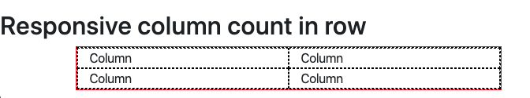

# Grid 이용하기.

이전에 배웠던 Layout 의 Container내에서 grid 를 이용할 수 있습니다.

그리드는 일종의 격자를 두고 Row 와 Column 으로 컨텐츠를 배치하는 방법입니다.

## 그리드 기본

Bootstrap 의 그리드는 12개의 칼럼을 가집니다. 또한 flexbox 를 이용하여 구현되었으며 완젼한 반응형을 제공합니다.

그리드의 기본을 알기 위해서 코드를 한번 보겠습니다.

/samples/Grid.html

```
<!DOCTYPE html>
<html lang="en">
  <head>
    <meta charset="UTF-8" />
    <meta name="viewport" content="width=device-width, initial-scale=1.0" />
    <meta http-equiv="X-UA-Compatible" content="ie=edge" />
    <title>Grid Samples</title>
    <link
      rel="stylesheet"
      href="https://stackpath.bootstrapcdn.com/bootstrap/4.4.1/css/bootstrap.min.css"
      integrity="sha384-Vkoo8x4CGsO3+Hhxv8T/Q5PaXtkKtu6ug5TOeNV6gBiFeWPGFN9MuhOf23Q9Ifjh"
      crossorigin="anonymous"
    />
    <style>
      .container {
        border: 1px solid red;
      }
      .col {
        border: 1px dashed black;
      }
    </style>
  </head>
  <body>
    <h2>Basic Grid</h2>
    <div class="container">
      <div class="row">
        <div class="col">
          First Column
        </div>
        <div class="col">
          Second Column
        </div>
        <div class="col">
          Third Column
        </div>
      </div>
    </div>
  </body>
</html>
```

### css style 지정하기.

코드에서 보시는 바와 같이 .container 는 붉은색 실선으로 지정했습니다.

칼럼은 검은색 점선으로 지정했습니다.

### 레이아웃 살펴보기.

레이아웃 구조는 다음과 같습니다.

.container 을 이용했습니다. 이전아티클에서 보았듯이 컨테이너는 특정 breakpoint 범위에 따라서 넓이 값을 고정할지 100%로 확장할지 지정할 수 있스빈다.

container 내부에 다시 .row 를 이용하여 그리드 row 를 하나 추가합니다.

row 하위에 다시 3개의 .col 을 추가했습니다.

결과를 보면 다음과 같이 고르게 넓이가 지정됨을 확인할 수 있습니다 .


row 가 container 에 꽉 차있으며, container 은 특정 넓이가 넘어섰기 때문에 1140px 로 되어 있음을 확인할 수 있습니다 .

## Grid 사용방법

grid 역시 breakpoint 를 지정할 수 있으며 다음과 같습니다 .

- .col-{칸수} : extra-small 브레이크 포인트 넓이의 칼럼을 그립니다. 그리드는 12개이므로 12개중 칸수를 지정하면 해당 넓이만큼 잡을 수 있습니다. 자동 넓이 지정입니다.
- .col-sm-{칸수} : small 브레이크 포인트 넓이의 칼럼을 그립니다. 540px 가 최대 넓이가 됩니다.
- .col-md-{칸수} : medium 브레이크 포인트 넓이의 칼럼을 그립니다. 720px 가 최대 넓이가 됩니다.
- .col-lg-{칸수} : large 브레이크 포인트 넓이의 칼럼을 그립니다. 960px 가 최대 넓이가 됩니다.
- .col-xl-{칸수} : extra large 브레이크 포인트 넓이의 칼럼을 그립니다. 1140px 가 최대 넓이가 됩니다.

## 다음 라인으로 column 넘기기

```
    <h2>Multi Line with w-100</h2>
    <div class="container">
      <div class="row">
        <div class="col">col</div>
        <div class="col">col</div>
        <div class="w-100"></div>
        <div class="col">col</div>
        <div class="col">col</div>
      </div>
    </div>
```

.w-100 을 이용하면 다음 라인으로 넘길 수 있습니다.

```
    <div class="container">
      <div class="row">
        <div class="col-6">col</div>
        <div class="col-6">col</div>
        <div class="col-6">col</div>
        <div class="col-6">col</div>
      </div>
    </div>
```

동일하게 col-6 를 이용하여 12 개의 칼럼을 다 채우면 자동으로 다음라인으로 내려갑니다.


보시는 바와 같이 2가지 예제는 동일합니다.

## 넓이를 컨텐츠 내용에 따라 조정하는 방법

`.col-{breakpoint}-auto`를 이용하면 컨텐츠 내용에 따라 column 넓이를 지정할 수 있습니다.

```
    <h2>Grid Column Width by content</h2>
    <div class="container">
      <div class="row">
        <div class="col">col</div>
        <div class="col-md-auto">col-md-auto</div>
        <div class="col-2">col-2</div>
      </div>
    </div>
```

보시는바와 같이 col-md-auto 가 있는 칼럼은 글자에 딱 맞게 넓이가 지정이 됩니다.

첫번재 칼럼은 넓이를 지정하지 않았으므로 화면 크기에 따라 자동으로 채워집니다.

그리고 마지막 칼럼은 넓이가 2로 지정됩니다.


## 반응형에 맞게 그리드 배치하기.

grid 는 기본적으로 반응형을 제공합니다.

그러나 반응형이라고 해서 항상 원하는 형태로 배치가 되지 않습니다.

bootstrap 은 여러개의 클래스를 이용하여 breakpoint 에 따라서 그리드 배치를 다르게 수행할 수 있습니다.

예를 들어 모바일 그리드 칼럼이 3개가 있고, PC 화면 에서는 가로로 3개 배치, 태블릿화면 에서는 가로로 2단으로 구성되어 상단은 전체 넓이, 다음단은 2개의 칼럼으로 배치하거나 모바일화면에서는 모두 세로로 배치한다고 가정해봅시다.

그럼 다음과 같이 예제를 작성해 주면 됩니다.

```
    <h2>Grid by responsive</h2>
    <div class="container">
      <div class="row">
        <div class="col-sm-12 col-lg-4">col</div>
        <div class="col-sm-6 col-lg-4">col-md-auto</div>
        <div class="col-sm-6 col-lg-4">col-2</div>
      </div>
    </div>
```

### PC 화면


### Tablet 화면


### 휴대폰 화면


보시는 바와 같이 다양한 반응형 화면에 따라 칼럼의 배치가 다르게 지정할 수 있습니다.

이렇게 반응형을 위한 여러개의 클래스 속성을 지정할 수 있게 됩니다.

## 하나의 row 에 들어갈 칼럼 개수 고정하기.

하나의 row 에 들어갈 칼럼 개수를 고정할 수 있습니다.

.row-col-{column개수} 으로 칼럼 개수를 지정할 수 있습니다. 이렇게 되면 반응형에 따라 breakpoint 가 변경이 되더라도 고정된 칼럼개수를 유지합니다.

```
    <div class="container">
      <div class="row row-cols-3">
        <div class="col">Column</div>
        <div class="col">Column</div>
        <div class="col">Column</div>
        <div class="col">Column</div>
      </div>
    </div>
```

위 예제는 하나의 row 에 3개의 칼럼으로 고정이 됩니다.


### 반응형으로 칼럼 개수를 고정

반응형으로 breakpoint 가 변경되더라도 칼럼 개수를 해당 breakpoint 에 따라 변경할 수 있습니다 .

```
    <div class="container">
        <div class="row row-cols-1 row-cols-sm-2 row-cols-md-4">
            <div class="col">Column</div>
            <div class="col">Column</div>
            <div class="col">Column</div>
            <div class="col">Column</div>
        </div>
    </div>

```

이전 예제에서와 같이 여러개의 클래스 속성을 지정했습니다.

middle 브레이크포인트에서는 4개의 칼럼을 사용하고, small 에서는 2개, 기본적으로 extra small 에서는 1개의 칼럼만을 가지게 설정했습니다.

PC 화면


태블릿 화면



휴대폰 화면


## Grid 정렬하기.

Gird 는 수직, 수평으로 정렬을 수행할 수 있으며, 정렬 기준은 Flex-Grid 의 정렬 기준을 따릅니다.

이 부분은 [Guide](https://getbootstrap.com/docs/4.4/layout/grid/) 을 참조합니다.

### 수직 row 배치하기.

row 단위 배치가 가능합니다.

```
<div class="container">
  <div class="row align-items-start">
    <div class="col">
      One of three columns
    </div>
    <div class="col">
      One of three columns
    </div>
    <div class="col">
      One of three columns
    </div>
  </div>
  <div class="row align-items-center">
    <div class="col">
      One of three columns
    </div>
    <div class="col">
      One of three columns
    </div>
    <div class="col">
      One of three columns
    </div>
  </div>
  <div class="row align-items-end">
    <div class="col">
      One of three columns
    </div>
    <div class="col">
      One of three columns
    </div>
    <div class="col">
      One of three columns
    </div>
  </div>
</div>
```


## 수직 칼럼단위 정렬하기.

칼럼 단위로 상단, 중단, 하단에 배치가 가능합니다.

기준은 다음과 같습니다.


[from](https://css-tricks.com/snippets/css/a-guide-to-flexbox/) 을 참조하세요.

```
<div class="container">
  <div class="row">
    <div class="col align-self-start">
      One of three columns
    </div>
    <div class="col align-self-center">
      One of three columns
    </div>
    <div class="col align-self-end">
      One of three columns
    </div>
  </div>
</div>
```


## 수평 정렬하기.

그리드를 수평으로 정렬할 수 도 있습니다.

칼럼의 공간이 남는경우 어느쪽으로 정렬을 할지 지정하는 것입니다.

기준은 다음과 같습니다.


[from](https://css-tricks.com/snippets/css/a-guide-to-flexbox/) 을 참조하세요.

```
<div class="container">
  <div class="row justify-content-start">
    <div class="col-4">
      One of two columns
    </div>
    <div class="col-4">
      One of two columns
    </div>
  </div>
  <div class="row justify-content-center">
    <div class="col-4">
      One of two columns
    </div>
    <div class="col-4">
      One of two columns
    </div>
  </div>
  <div class="row justify-content-end">
    <div class="col-4">
      One of two columns
    </div>
    <div class="col-4">
      One of two columns
    </div>
  </div>
  <div class="row justify-content-around">
    <div class="col-4">
      One of two columns
    </div>
    <div class="col-4">
      One of two columns
    </div>
  </div>
  <div class="row justify-content-between">
    <div class="col-4">
      One of two columns
    </div>
    <div class="col-4">
      One of two columns
    </div>
  </div>
</div>
```


