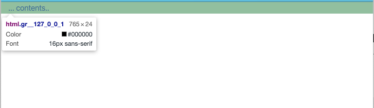
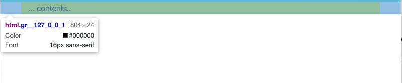

# Boostrap Layout 기본

UXStudio 는 Bootstrap CSS Framework 를 기본으로 개발 되었습니다.

Bootstrap 을 이용하기 앞서 가장 먼저 이해해야하는 것이 바로 Layout 입니다.

## Containers

컨테이너는 가장 기본적인 레이아웃 엘리먼트입니다. 보통 기본적인 그리드 시스템을 이용하기 위해서 반드시 필요한 요소입니다.

컨테이너는 다음과 같이 사용할 수 있습니다.

- .container: 각 반응형 breakpoint 에서 max-width 셋으로 설정합니다.
- .container-{breakpoint}: breakpoint 에 지정된 크기가 설정되기 전까지 100% 의 넓이를 차지하도록 합니다.
- .container-fluid: 전체 넓이를 100%로 지정합니다.

### breakpoint

breakpoint 는 반응형 웹을 위한 특정 pixel 지점을 나타냅니다. bootstrap 에서는 xs, sm, md, lg, xl 을 지원하며 상세한 사항은 다음과 같습니다.

xs: extra small / `< 576px` 의 크기 범위인경우 적용됩니다.
sm: small / `>= 576px` 의 크기 범위인경우 적용됩니다.
md: medium / `>= 768px` 의 크기 범위인경우 적용됩니다.
lg: large / `>= 992px` 의 크기 범위인경우 적용됩니다.
xl: extra large / `>=1200px` 의 크기 범위인경우 적용됩니다.

|                  | Extra small | Small | Medium | Large | Extra large |
| :--------------- | :---------- | :---- | :----- | :---- | :---------- |
| .container       | 100%        | 540px | 720px  | 960px | 1140px      |
| .container-sm    | 100%        | 540px | 720px  | 960px | 1140px      |
| .container-md    | 100%        | 100%  | 720px  | 960px | 1140px      |
| .container-lg    | 100%        | 100%  | 100%   | 960px | 1140px      |
| .container-xl    | 100%        | 100%  | 100%   | 100%  | 1140px      |
| .container-fluid | 100%        | 100%  | 100%   | 100%  | 100%        |

위 테이블 표와 같이 container 은 특정 breakpoint 가 되기전까지는 100% 넓이를 가집니다.

그러다가 breakpoint 지점 이후부터는 고정된 크기로 넓이가 지정됩니다.

이것이 반응형의 핵심 입니다.

#### 샘플 예시

./samples/containers.html

```
<!DOCTYPE html>
<html lang="en">
  <head>
    <meta charset="UTF-8" />
    <meta name="viewport" content="width=device-width, initial-scale=1.0" />
    <meta http-equiv="X-UA-Compatible" content="ie=edge" />
    <title>Container Sample</title>
    <link
      rel="stylesheet"
      href="https://stackpath.bootstrapcdn.com/bootstrap/4.4.1/css/bootstrap.min.css"
      integrity="sha384-Vkoo8x4CGsO3+Hhxv8T/Q5PaXtkKtu6ug5TOeNV6gBiFeWPGFN9MuhOf23Q9Ifjh"
      crossorigin="anonymous"
    />
  </head>
  <body>
    <div class="container-md" style="background: yellow;">
      ... contents..
    </div>
  </body>
</html>
```

이런 코드를 작성했다면, 화면을 768px 이하인경우에는 넓이를 100% 로 채워줍니다.
그러다가 화면을 늘여서 768px 를 이상이 되면 div 넓이를 720px 로 고정하고, 화면의 가운데 위치 시킵니다.

브라우저 넓이가 765px 경우



브라우저 넓이가 768px 이상인경우



보시는 바와 같이 `...contents` 의 위치와 노란색 백그라운드 표시가 첫번째와 두번째가 다릅니다.

첫번재는 `100%` 채워진 모습, 두번째는 `720px` 로 `가운데 정렬`된 모습을 확인할 수 있습니다.

위 반응형 규칙을 잘 이해하면 Bootstrap 으로 화면을 만들때 매우 유용합니다.

## 사용처

보통 container-fluid 는 사이트 전체 레이아웃을 만들때 주로 이용합니다.

예를 들어 화면 상단에 메뉴바(GNB)를 만든다든지 하는경우에는 container-fluid 를 이용하여 메뉴바를 전체 화면에 100% 채우도록 만듭니다.

container 의 경우 컨텐츠 넓이를 고정할때, 혹은 레이아웃 내의 하위 컨텐츠를 표현할때 container 을 이용하면 깔끔한 화면을 만들 수 있습니다.
