# UX Template Bootstrap 소개

UX Template은 화면 개발을 위한 템플릿을 제공해주는 역할을 수행합니다.

프런트엔드 템플릿으로 Bootstrap, React, Vue 를 지원하며 이번 아티클에서는 Bootstrap 을 기준으로 소개 합니다.

## 사이트 살펴보기.

우선 UXStudio 사이트를 살펴 보겠습니다.

[UXStudio](https://uxstudio.sktelecom.com) 에 접근합니다.

로그인을 해야 template 을 다운로드 받을 수 있으며, TDE 회원 가입이 되고 승인이 되어야 로그인이 가능합니다.

### 사이트 로그인하기.

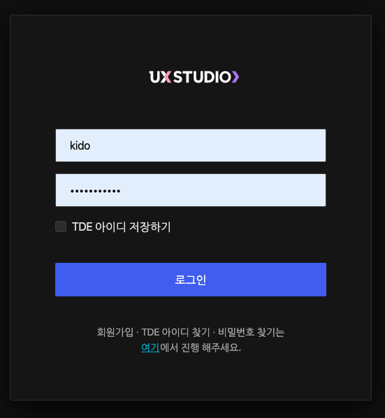

아이디와 패스워드를 입력하고 로그인 합니다.

### Template 선택하기

uxstudio 는 다음과 같은 테마를 제공합니다.

- Basic theme: 가장 기본적인 테마로 어드민 화면을 개발하기에 무난한 테마입니다. Basic Dark, Basic Light 를 지원하여 사용할 수 있습니다.
- Landing & Manage Project: 일반적인 사이트의 테마 입니다. UXStudio 는 이 테마로 개발되었습니다. UXS-Hybrid 는 UXStudio를 개발한 테마이며, UXS-SKT 는 SKT 디자인을 살린 템플릿 입니다.
- Community: 커뮤니티 테마는 페이스북과 같이 SNS 를 개발하기 위한 템플릿 입니다.
- Corporate & Portifolio: 기업형 브랜드 사이트를 개발하기 적합한 템플릿 입니다.

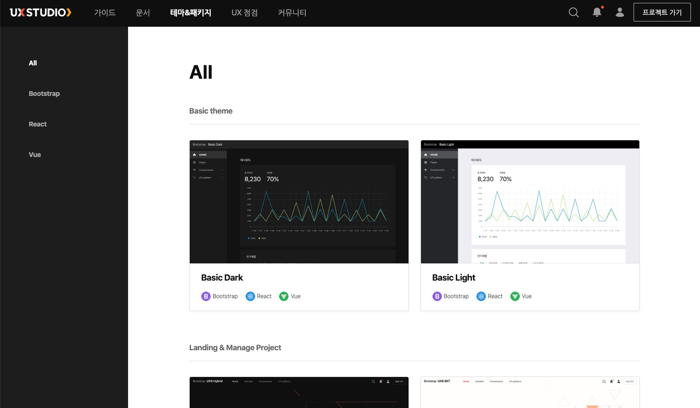

### Basic Light 사용하기.

Basic Light 을 클릭하고, 부트스트랩 메뉴를 선택한 후에 `다운로드` 를 선택합니다.

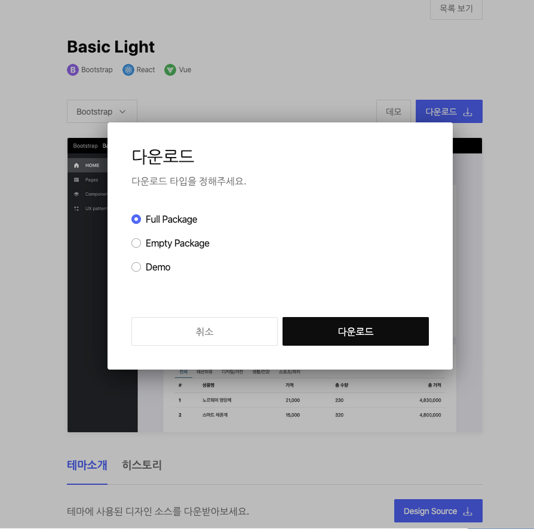

- Full Package: 풀 패키지는 모든 컴포넌트들 포함하고 있는 패키지 입니다. 이 패키지를 이용하면 컴포넌트, 패턴 등을 마음껏 이용할 수 있습니다.
- Empty Package: 엠티 패미지는 기본적인 컴포넌트와 레이아웃만 가지고 있습니다. 프레임워크화를 위해서 디렉토리가 이미 작성되어 있는 비어있는 패키지 입니다. 보통 EmptyPackage 로 부터 작업을 진행하시면 됩니다.
- Demo: Demo 패키지는 `데모` 버튼을 클릭하면 나타나는 팝업 사이트를 만들때 사용한 소스들이 포함됩니다. 데모 패키지는 샘플들을 주로 사용할 수 있어 참조용으로 사용하는 패키지 입니다.

Empty Package 를 다운로드 합니다.

그리고 Demo Package 를 다운로드 역시 해줍니다.

다운로드 하시고나면 적당한 IDE 를 통해 파일을 열어줍니다.

### 기본적인 디렉토리 구조 이해하기.

#### Empty Package 구조

Bootstrap 은 CSS Framdwork 입니다.

그러므로 내부적으로는 asset 들만 존재합니다.

- assets/common/fonts: 폰트 및 아이콘을 가지고 있는 디렉토리 입니다.
- assets/common/img: 이미지는 아이콘 이미지를 가지고 잇으며, svg 디렉토리는 아이콘 svg 파일들을 가지고 있습니다.
- assets/common/js: 차트, 데이트 피커, 하일라이트, 스크롤바 등을 위한 자바 스크립트 입니다. UXStudio 는 기본적으로 chartjs 를 제공하고 있습니다.

- assets/light/css: basic-light 의 기본적인 css 파일을 담고 있습니다.
- assets/light/css/scss: scss 는 css 를 프로그래밍 방법으로 개발할 수 있는 precompile 컴포넌트로 다이나믹한 스타일링이 가능합니다.
- assets/light/css/vendor: 특정 vendor 가 만든 css 파일을 저장합니다. uxstudio 에서는 ckEditor 용 css 를 담고 있습니다.
- assets/light/img: 샘플 이미지들을 가지고 있습니다. 딱히 없어도 무방합니다.

위 디렉토리 구조를 바탕으로 화면 개발을 진행하실때 해당 assets 의 위치를 로드하면 됩니다.

예를 들어.

```
<link rel="stylesheet" href="assets/light/css/uxs.css" crossorigin="anonymous">
```

을 html 파일에 추가해주시면 됩니다.

그럼 기본적으로 BootStrap 컴포넌트들을 바로 이용할 수 있으며, UXStudio Template 을 바로 이용할 수 있게 됩니다.

## Template 를 이용하여 화면 개발하기.

우리는 UXStudio Empty package 다운받았기 때문에 스타일링된 UXStudio 패키지만 가지고 있습니다.

이번에는 bootstrap 사이트에 들어가서 샘플 파일을 하나 복사해서 dashboard.html 파일을 작성해 보겠습니다.

bootstrap 사이트는 [여기](https://getbootstrap.com/docs/4.4/examples/) 를 참조하세요.

이 중에서 [Pricing](https://getbootstrap.com/docs/4.4/examples/pricing/) 을 열어보겠습니다.

기본 소스 화면은 다음과 같습니다.

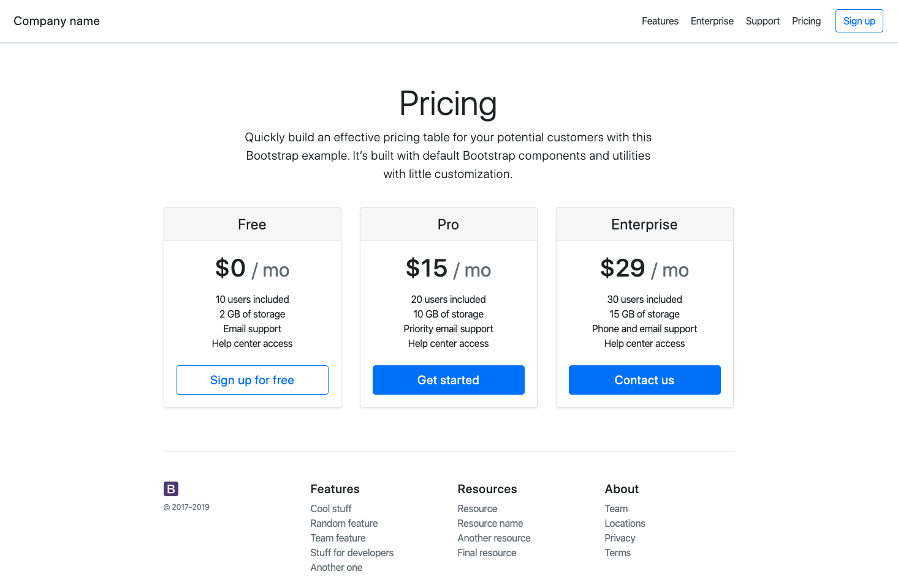

`마우스 오른쪽 클릭 > 소스코드` 를 통해서 소스를 모두 복사해 줍니다.

### UXStudio css 링크 걸기.

```
<!-- Bootstrap core CSS -->
<link href="/docs/4.4/dist/css/bootstrap.min.css" rel="stylesheet" integrity="sha384-Vkoo8x4CGsO3+Hhxv8T/Q5PaXtkKtu6ug5TOeNV6gBiFeWPGFN9MuhOf23Q9Ifjh" crossorigin="anonymous">

```

부분을 아래와 같이 바꿔 줍니다.

```

<!-- Bootstrap core CSS -->
<link href="assets/light/css/uxs.css" rel="stylesheet">

```

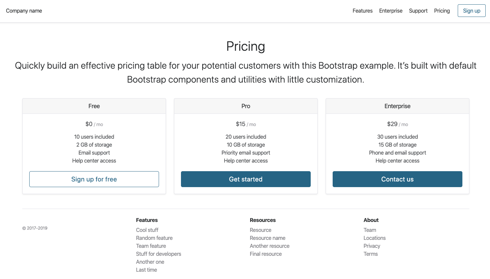

로 uxstudio 스타일이 적용되었습니다.

### 메뉴를 다크모드로 변경하기.

UXStudio Light 모드에 해당하는 헤더를 변경하기 위해서 메뉴 부분을 다음코드로 변경해줍니다.

```
  <body>
    <div
      class="d-flex flex-column flex-md-row align-items-center p-3 px-md-4 mb-3 bg-dark border-bottom shadow-sm"
    >
      <h5 class="text-light my-0 mr-md-auto font-weight-normal">
        Company name
      </h5>
      <nav class="my-2 my-md-0 mr-md-3">
        <a class="p-2 text-light" href="#">Features</a>
        <a class="p-2 text-light" href="#">Enterprise</a>
        <a class="p-2 text-light" href="#">Support</a>
        <a class="p-2 text-light" href="#">Pricing</a>
      </nav>
      <a class="btn btn-outline-primary" href="#">Sign up</a>
    </div>
```

- 가장 바깥쪽의 d-flex 부분에서 bg-white 를 bg-dark 로 바꿔줍니다.
- h5 class 부분에 text-light 를 추가해 줍니다.
- 그리고 class="p-2 text-dark" 부분을 class="p-2 text-light" 로 바꿔줍니다.

이렇게만 바꾸면 메뉴는 다크모드이며, 컨텐츠는 white 로 바뀐것을 확인할 수 있습니다 .

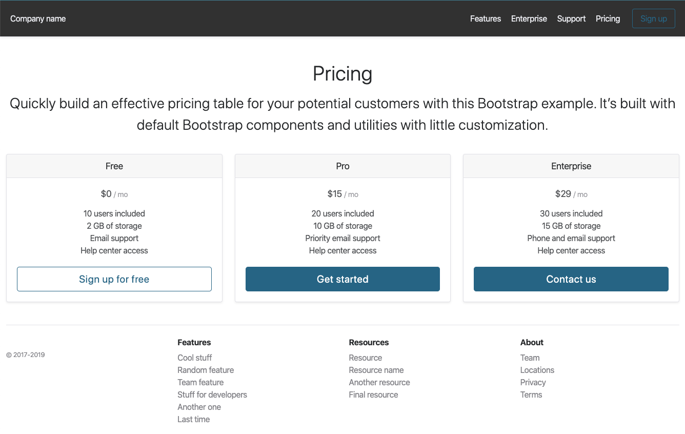

## UXStudio 에 최적화된 화면 작성하기.

지금까지 css 테마만을 이용하고, bootstrap 을 직접 복사해왔으나, 사실 이렇게 작업하면 수정해 주어야할 부분이 많습니다.

UXStudio Demo 를 이용하여 샘플 소스들을 그대로 이용하면 최적화된 UXStudio Demo 화면을 그대로 이용할 수 있습니다.

UXStudio 에서 `데모` 버튼을 클릭하면 새로운 팝업이 오픈됩니다.

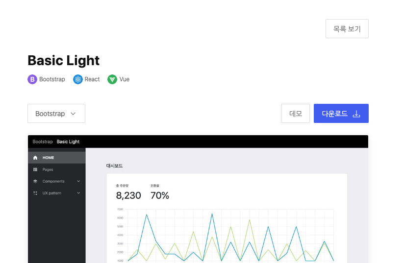

### 샘플 대시보드 선택하기.

새로운 페이지가 열리면 여기서, 사용할 샘플 코드를 찾아봅니다.

- HOME: 대시보드를 보여줍니다.
- Pages: 페이지는 다양한 샘플을 볼 수 있습니다 .
- Components: 컴포넌트들은 현재 테마가 적용된 컴포넌트 목록을 볼 수 있습니다.
- UX Pattern: 패턴은 특정 목적으로 컴포넌트들이 묶여 있는 묶음으로 볼 수 있습니다.

`Pages > Dashboard3` 을 선택합니다.

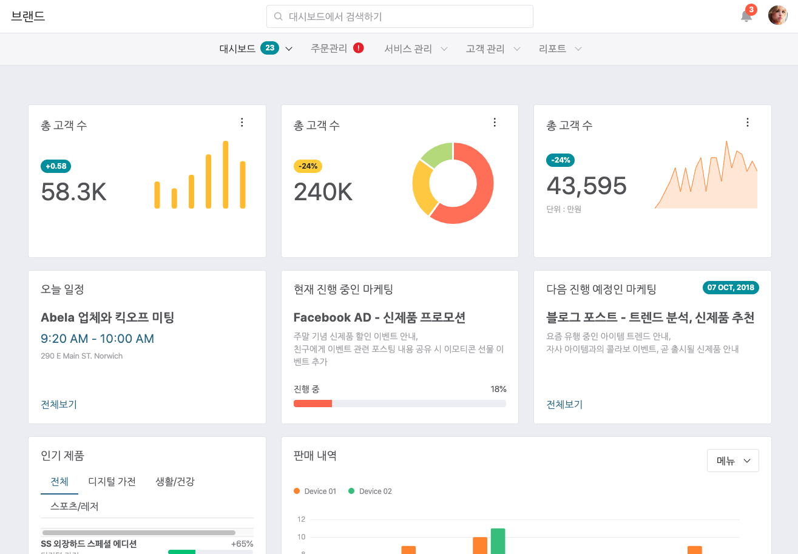

### Empty 패키지에 대시보드 파일 만들기.

Empty 패키지에서 dashboard3.html 파일을 하나 만들어 줍니다.

`https://uxstudio.sktelecom.com/demo/light/bootstrap/theme/light/pages/dashboard_3.html` 에서 `페이지 소스보기`로 소스를 열고 복사를 합니다.

복사한 소스를 그대로 dashboard3.html 에 붙여넣기 합니다.

위에서 본 바와 같이 동일한 화면을 보여줍니다.

### 필요없는 소스 제거하기.

아래와 같이 컴포넌트를 제거하고, 필요한 컴포넌트는 적절한 위치로 이동 시키겠습니다.

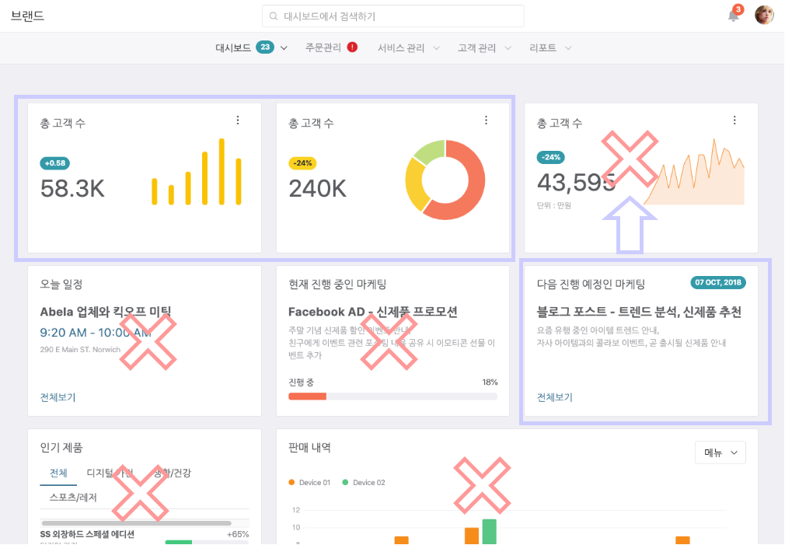


### 구조 파악하기. 

우리가 복제해온 코드의 구조를 파악해 보겠습니다. 

#### 헤더 영역.

헤더 영역은 메뉴 바를 나타냅니다. 

메뉴 바는 상단 검색영역, 하단 메뉴 부분을 나타냅니다. 

```
  <body>
    <!-- wrapper -->
    <div class="wrapper bg-light">

      <!-- theme-header -->
      <header class="theme-header theme-header-center">
      </header>
      <!-- /theme-header -->
```

#### 바디 영역 > 사이드 바 영역

바디 사이드바의 경우, 반응형으로 모바일 크기로 변경된 경우 노출되는 메뉴 입니다. 

```
      <!-- theme-body -->
      <div class="theme-body theme-body-overlap theme-body-overlap-md-hidden">
        <!-- sidebar -->
        <div class="theme-sidebar">
        </div>
        <!-- /sidebar -->
```

#### 바디 영역 > 컨텐츠 영역 > 첫번째 row 

컨텐츠 첫번째 row 의 경우 상단 3개의 차트를 나타냅니다. 

row 하위에는 3개의 칼럼이 있으며, 각각마다 차트가 들어간다고 보시면 됩니다. 

이 중 2개는 사용하며, 마지막 차튼는 제거할 예정입니다. 

```
        <!-- theme-contents -->
        <main class="theme-contents contents-mt">
          <div class="theme-column">
            <div class="row">
              <div class="col-xl-4 col-sm-6">
              </div>
              <div class="col-xl-4 col-sm-6">
              </div>
              <div class="col-xl-4">
              </div>
            </div>

```

#### 두번째 row

두번째 row 는 지표를 나타내는 카드 영역역으로 3개의 칼럼이 있으며 

이중 마지막 칼럼만을 첫번째 row 의 마지막 칼럼으로 대체해 주게 됩니다. 

```
            <div class="row">
              <div class="col-xl-4 col-sm-6">
              </div>
              <div class="col-xl-4 col-sm-6">
              </div>
              <div class="col-xl-4">
              </div>
            </div>
```

#### 세번째 row

세번째 row 는 하나의 탭 영역과, 차트 영역을 다른 크기로 나타나도록 했습니다. 

이 부분은 모두 사용하지 않을 것이므로 row 전체를 제거합니다. 

```
            <div class="row">
              <div class="col-md-4 col-sm-12">
              </div>
              <div class="col-md-8 col-12">
              </div>
            </div>
          </div>
        </main>
        <!-- /theme-contents -->
      </div>
      <!-- /theme-body -->

    </div>
    <!-- /wrapper -->
```

코드를 제거하고, 대체하기를 완료하면 다음과 같은 화면이 될 것입니다. 

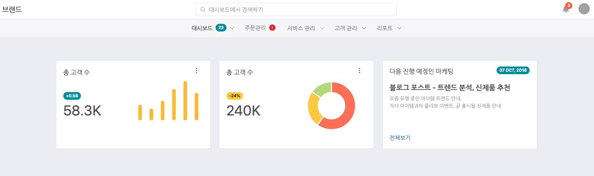

## 검색 및 테이블 연동해주기. 

검색이 포함된 테이블과 같은 내용은 Pattern 이용하면 편리합니다. 

### 우선 검색 및 테이블이 들어갈 공간 만들기. 

이전 샘플에서 보았던 것과 같이 row 와 col 을 추가해 줍니다. 

``` 
    <!-- ... 이전 제거한 소스 이후 부분 >
              <div class="row">
                  <div class="col-12">
                    <!-- ... 이 부분에 테이블 소스를 붙여넣어 주세요.  >
                  </div>
              </div>
```

`Demo Site > UX Pattern > Tables` 에서 `Advanced Search` 를 찾습니다. 

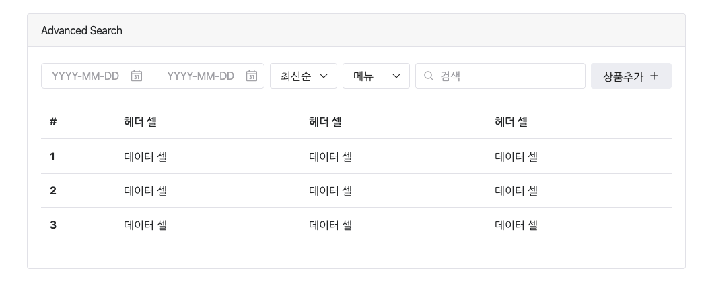

이 부분을 Chrome 에서 `마우스 오른쪽 클릭 > 검사` 를 통해서 영역을 선택합니다. 

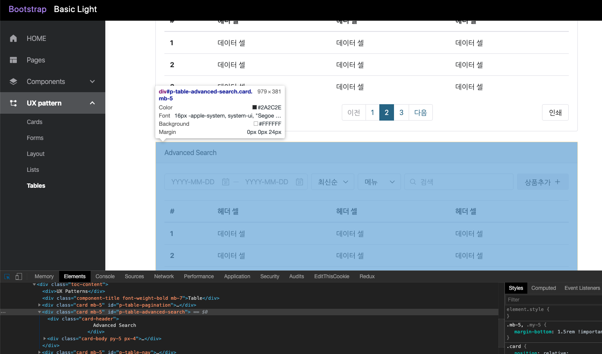

그리고 해당 소스 영역을 Ctrl + C 로 복사 합니다. 

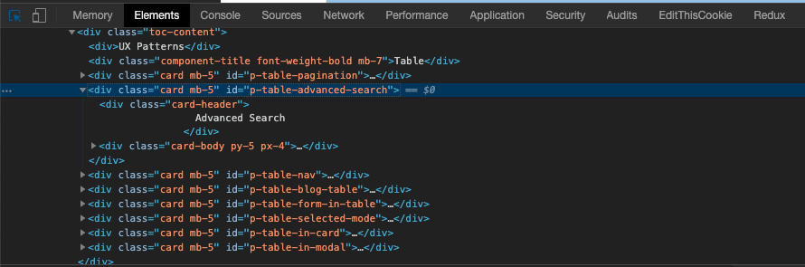

그리고 조금전에 만들었던 공간 부분에 Ctrl + V 로 붙여 줍니다. 

그리고 다시 브라우저를 열어보면 다음과 같이 정상적으로 화면 배치가 되었음을 알 수 있습니다. 

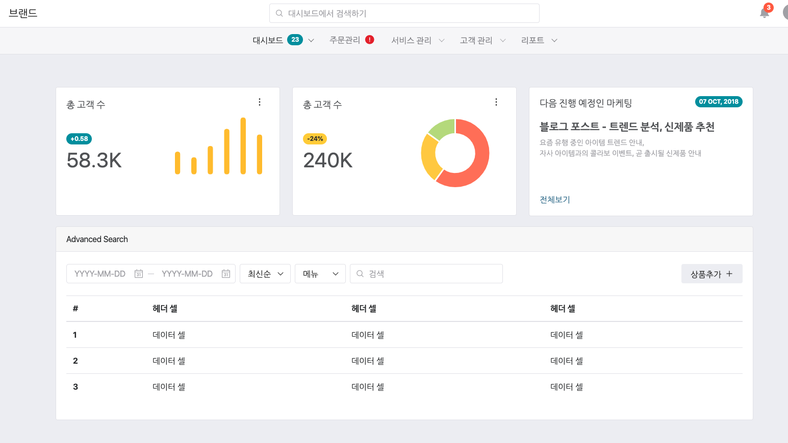

동일한 방법으로 paging 도 Component 나, Pattern 등에서 복사해서 붙여 넣기 해주시면 됩니다. 

## 마치며.

지금까지 UXStudio Bootstrap 을 이용한 화면을 만드는 방법을 알아보았습니다. 

사실 Bootstrap 의 경우 샘플을 가져와서 직접 작성을 하시는 것이 가장 편리합니다. 

그리고 점점 코드의 구조를 이해하면서 부터 약간의 미세 조정이나, 처음부터 만들어 가는 방향으로 작업을 하시면 됩니다. 

Bootstrap 으로는 화면만을 구성하는 것이 보통이며, 화면단의 액션은 javascript 나 jQuery 가 권장이 됩니다. 

구체적인 사용 설명에 대해서는 [https://getbootstrap.com/docs/4.4/getting-started/introduction/](https://getbootstrap.com/docs/4.4/getting-started/introduction/) 에서 참조하시면 좋습니다. 