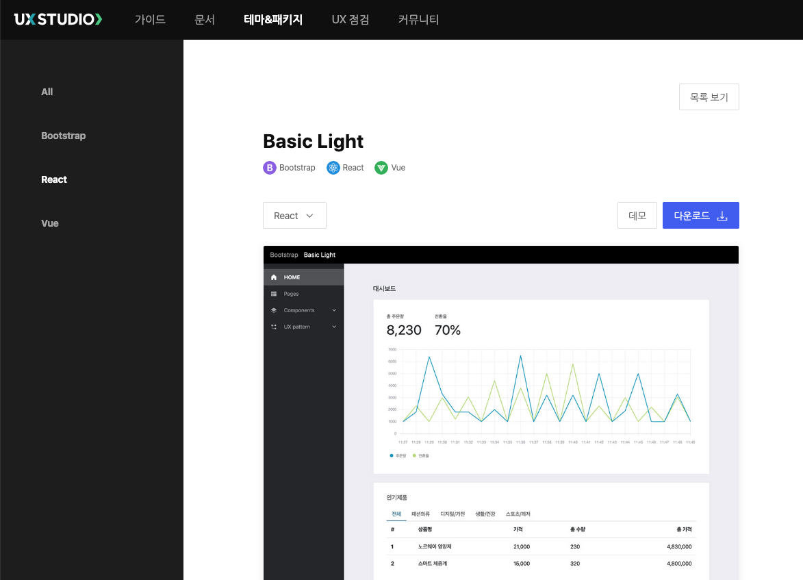
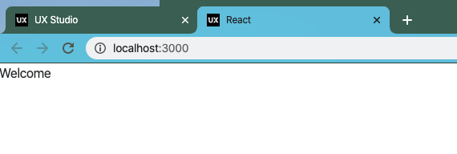

# UXStudio React Chapter 01 - 컴포넌트 구조 이해하기.

UXStudio 는 Front End Framework 중 가장 많이 사용하고 있는 React 를 지원합니다.

UXStudio 가 Bootstrap 을 베이스로 만들어 졌기 때문에 React 프레임워크도 React-Bootstrap 를 베이스로 하고 있습니다.

## 알아두면 좋은 내용.

UXStudio 는 React 를 적극 지웒기 위해 다음과 같은 기술을 이용합니다.

- react: [https://reactjs.org/tutorial/tutorial.html](https://reactjs.org/tutorial/tutorial.html)

리액트는 Facebook 에서 개발하고 오픈소스화 한 FrontEnd Framework 이며, 현재 가장 많이 사용하는 프레임 워크입니다.

- react-bootstrap: [https://react-bootstrap.github.io/](https://react-bootstrap.github.io/)

react-bootstrap 은 bootstrap css 프레임워크를 react 버젼에서 사용할 수 있도록 wrapping 한 프레임워크입니다.

bootstrap 을 컴포넌트로 바로 사용하면 jQuery 와 DOM 처리 방식이 다르므로 원하는 동작을 올바르게 수행하지 못할 수 있습니다. 이러한 이슈로 인해서 react-bootstrap 을 사용하는 것을 권장하고 있으며, UXStudio react 버젼은 react-bootstrap 를 기본으로 하고 있습니다.

- redux: [https://thub.sk.com/board/viewArticle.do?id=158569](https://thub.sk.com/board/viewArticle.do?id=158569)

redux는 react 가 가지고 있는 문제점인 복잡한 사이트의 경우 Props 전달이 복잡하고 깊어지는 단점을 해소하기 위한 state 관리 모듈입니다.

react를 기준으로 redux 가 동작하게 됩니다.

- redux-saga: [https://thub.sk.com/board/viewArticle.do?id=158570](https://thub.sk.com/board/viewArticle.do?id=158570)

redux-saga 는 redux 의 상태관리가 synchronous 하게 관리되고 있기 때문에, 성능 저하 및 상태 변경에 대한 병목을 해결하기 위해서 asynchronous 하게 상태 관리를 수행하도록 해주는 비동기 처리 모듈입니다.

redux-saga 를 이용하면, 리액트를 유연하고, 우수한 퍼포먼스를 발휘할 수 있도록 구현할 수 있습니다.

- ImmerJS: [https://immerjs.github.io/immer/docs/introduction](https://immerjs.github.io/immer/docs/introduction)

ImmerJS 는 Redux 상태관리 Policy 를 매우 쉽게 따를 수 있도록 해줍니다.

redux 에서는 상태를 한곳에서 관리, state 는 직접 수정을 할 수 없도록 해야함, 그리고 마지막으로 상태 변경은 순수함수를 통해서 이루어 져야한다는 정책을 지키도록 가이드 하고 있습니다.

이때 순수함수를 개발하는 경우 ImmerJS 는 간결한 코드로 효과적인 순수함수를 만들 수 있도록 편리한 기능들을 제공합니다 .

- DucksPattern: [https://github.com/erikras/ducks-modular-redux](https://github.com/erikras/ducks-modular-redux)

Ducks 패턴은 리덕스를 이용하여 개발할때 여러 파일이 흩어져서(action, store, reducer) 개발하는 것을 하나의 파일에서 모두 만들도록 하는 패턴입니다.

이 패턴을 이용하면 개발시 파일 관리가 편리하며, 하나의 일을 처리하는 리덕스를 하나의 파일에서 관리하므로 유지보수 성이 향상됩니다.

## 파일 다운로드 받기.

UXStudio > 테마&패키지 > React > Basic Light 를 선택합니다.

해당 화면에서 `다운로드` 를 클릭합니다.



억시 동일하게 Full, Empty, Demo 패키지가 있습니다.

- Full Package: 는 기본적으로 컴포넌트, 패턴 등의 리액트를 사용하여 화면을 개발하기 위한 전체 소스를 담고 있는 패키지 입니다.
- Empty Package: 는 HelloWorld 에 해당하는 패키지입니다. 기본적인 디렉토리 구조와, 구동만을 위한 코드들로 구성되어 있습니다.
- Demo: 데모 버튼을 클릭했을때 나타나는 패키지이며, 리액트를 통한 라우팅등의 소스를 이 소스에서 확인해 볼 수 있습니다.

우리는 여기서 Demo 와 Empty 패키지를 다운로드 받겠습니다.

Demo 는 단순히 참조를 위한 패키지이며, Empty 패미지에서 실제 작업을 수행하도록 할 예정입니다.

## 파일 디렉토리 구조 이해하기.

- public: pubilc 디렉토리는 react 가 아닌 일반 html 관련 요소들을 담아두는 곳입니다. 이미지, css, js 파일등 일반적인 파일이 포함됩니다.
  - assets: UXStudio 테마를 위한 리소스들이 포함되는 위치입니다.
    - common: 공통적으로 사용되는 파일들이 위치합니다.
      - fonts: 적용된 폰트가 존재합니다.
      - img: 공통 이미지가 존재합니다.
      - js: 공통 js 파일이 존재하며 보통 차트, ck editor 등이 포함됩니다.
    - light: 테마 css 가 포함됩니다.
      - css: 테마를 위한 css, scss 파일등이 포함됩니다.
      - img: 이미지가 위치됩니다.
  - index.html: 이 파일은 react 가 가장먼저 로드하는 파일입니다.
- src: 리액트 소스가 존재합니다.
  - components: 기본적으로 react-bootstrap 를 구현한 컴포넌트들이 배치됩니다.
    - chart: 차트 컴포넌트가 존재합니다.
    - editor: 에디터 컴포넌트가 존재합니다. ckeditor 를 지원합니다.
  - containers: 컨테이너는 컴포넌트와 리덕스를 연동해주는 역할을 하는 파일들이 있는 곳입니다.
    - layout: 리액트 레이아웃이 대표적인 컨테이너이니다. 컨테이너내 동작해야할 다양한 액션들 그리고 리듀서가 연동될 것입니다.
  - pages: 페이지는 각 SPA (Single Page Application) 에서 하나의 화면을 나타냅니다. 보통 하나의 어플리케이션은 메뉴별 혹은 기능별 여러 pages 를 가집니다.
  - store: store 는 redux 에서 state 를 관리하는 장소입니다. 우리는 ducks 패턴을 이용하여 상태를 관리할 것이며, 여기에서 덕스패턴으로 상태관리 파일들을 생성합니다.
    - model: 모델은 각 화면마다 관리되어야 할 상태에 대해서 덕스 패턴 파일을 생성해서 넣어놓는 곳입니다.
  - index.js: 리액트가 동작할때 가장 먼저 컴파일되어 화면에 렌더링 되는 파일입니다. 즉, 어플리케이션의 가장 최상위 컴포넌트 파일이 됩니다.
- package.json: 현재 어플리케이션의 의존성, 컴파일, 실행 등을 관장하는 파일입니다.

## Welcome 페이지 실행해보기.

가장먼저 react 를 위해서는 node.js 를 설치해야합니다.

[nodejs download](https://nodejs.org/ko/download/) 에서 각 환경에 맞는 설치파일을 다운로드 해주세요.

필요하다면 환경 설정을 해주시면 됩니다.

Centos 참조

[https://thub.sk.com/board/viewArticle.do?id=55254](https://thub.sk.com/board/viewArticle.do?id=55254)

### 의존성 설치하기.

nodejs 를 이용한 프로그램은 보통 의존성 관리를 위해서 npm 이나 yarn 을 이용합니다.

받은 소스 파일에서 package.json 이 있는 디렉토리로 이동하여 다음 명령어를 실행합니다.

```
npm install
```

이렇게 하면 npm 이 자동적으로 packagejs

우선 가장먼저 의존성 파일을 모두 로드하기 위한 작업을 합니다.

### 실행하기.

react 는 일반적으로 Local 환경에서 개빌 시에는 아래와 같이 실행할 수 있습니다 .

```
npm run start
```

그리고 실제 배포시에는 빌드후 컴파일된 소스를 원하는 정적 서비스에 업로드하여 서비스를 수행할 수 있습니다.

```
npm run build
```

위와 같이 수행하면 target 디렉토리가 생성이 되며, 생성된 결과 파일을 업로드 하면 됩니다.

결과 화면은 다음과 같습니다.



지금까지 React 템플릿의 구조와 Empty 패키지를 dev 모드로 실행해 보았습니다.

처음에는 복잡해 보이지만, 하나씩 만들어가다보면, 쉽게 화면 구성을 하실 수 있을 것입니다.
