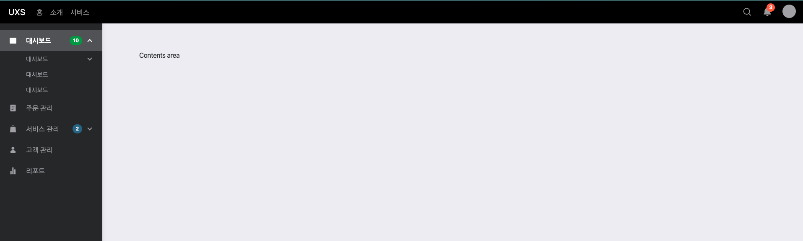
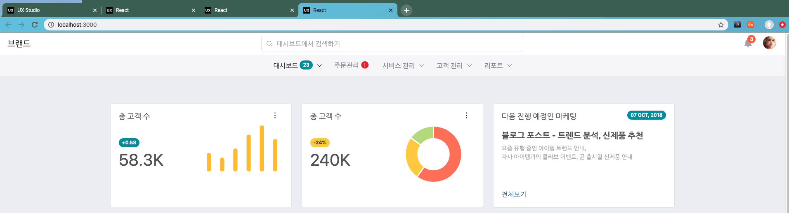
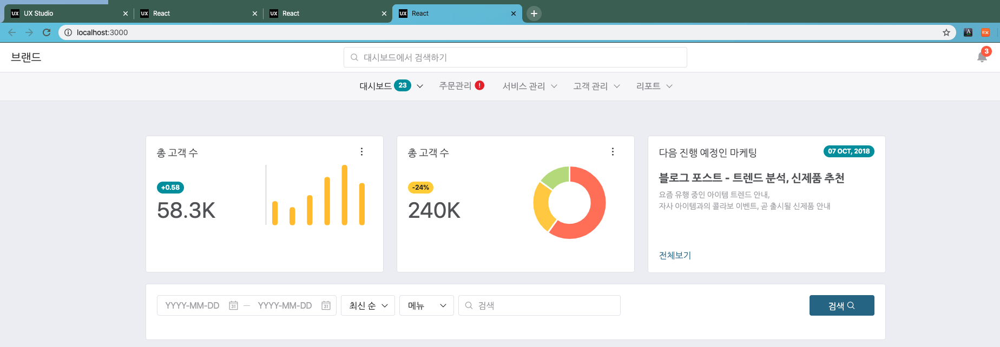

# UXStudio React Chapter 02 - 컴포넌트 배치하기.

## 컴포넌트 레이아웃 확인하기.

컴포넌트 레이아웃은 프런트 화면을 개발하기 위한 첫번째 단계입니다.

우리는 이러한 컴포넌트 레이아웃을 위해 2가지 방법을 제공합니다.

첫번째는 샘플 Pages 를 이용한 레이아웃이며, 다른 하나는 UX Pattern 을 이용한 Layout 이용방법입니다.

### 샘플 Pages 를 이용한 레이아웃

우선 가장먼저 할 것은 우리가 만들고자 하는 기획 화면과 유사한 레이아웃을 찾는 것입니다.

UXStudio 에서 제공하는 샘플 레이아웃에서 가장 가까운 레이아웃을 찾을 수 있습니다.

[UXStudio 테마&패키지](https://uxstudio.sktelecom.com/themePackageDetail/2/all) > Basic Light 의 "데모" 를 선택합니다.


새로운 창으로 데모 페이지가 열리게 됩니다.

데모 페이지는 실제 샘플들을 확인할 수 있는 페이지이며 `Pages` 메뉴를 클릭하면 필요한 레이아웃들이 나열됩니다.


Dashboard3 을 클릭하면 대시보드 샘플 3이 오픈됩니다.


### UX Pattern > Layout 이용한 레이아웃

UX Pattern 은 다양한 패턴을 제공합니다.

패턴의 하나로 Layout 을 제공하며 UX Pattern > Layout 메뉴를 클릭합니다.


위와 같은 화면이 나타나며, 3가지 레이아웃을 제공하고 있습니다.

#### Universal navigation



#### Universal navigation + Sliding (Accordion)1


#### Universal navigation + Sliding (Accordion)2


위 화면에서 제시한것과 같이 원하는 레이아웃을 선택하시면 됩니다.

## 컴포넌트 배치하기.

컴포넌트 배치는 UXStudio 에서 제공하는 샘플 Pages 컴포넌트를 이용하겠습니다.

### 컴포넌트 배치를 위한 계획

우리는 Dashboard3 을 이용할 것입니다.

그리고 Dashboard3 를 아래 화면과 같이 변경할 것입니다.


### Dashboard3 소스 복사해오기.

Dashboard3 는 Demo 소스내에 Dashboard3 파일을 복사합니다 .

`src/pages/sample/dashboard/Dashboard3.js` 에 위치하고 있습니다.

복사한 파일을 `src/pages/dashboard/Dashboard3.js` 에 복사해 옵니다.

### Dashboard3 컴포넌트가 메인 화면에 나타나도록 수정하기.

`src/index.js` 파일에서 Welcome 컴포넌트를 Dashboard3 로 변경해줍니다.

```
import React from 'react';
import ReactDOM from 'react-dom';
import { Provider } from 'react-redux';
import configureStore from './store/configure';
import Dashboard3 from './pages/dashboard/Dashboard3';

const store = configureStore();

ReactDOM.render(
  <Provider store={store}>
    <Dashboard3 />
  </Provider>,
  document.getElementById('root'),
);

```

위와 같이 변경해줍니다.

```
npm run start
```

를 실행해보면 다음과 같은 오류가 나타납니다.

```
Failed to compile.

./src/pages/dashboard/Dashboard3.js
Module not found: You attempted to import ../../../components which falls outside of the project src/ directory. Relative imports outside of src/ are not supported.

```

위 오류는 Dashboard3 가 데모 컴포넌트의 소스와 다르기 때문에 나타나는 오류입니다.

경로를 한단계 수정해줄 필요가 있기 때문에 `./src/pages/dashboard/Dashboard3.js` 파일 내에서

`../../../component` 와 같은 경로를 모두 `../../component` 처럼 한단계 올려줍니다.

결과 화면이 다음과 같이 나타납니다.


### 레이아웃내 컴포넌트 수정하기.

우선 컴포넌트의 내부 소스중 메인 부분을 확인해보겠습니다.

```
  const Dashboard = () => (
    <>
      <div className="theme-column">
        <Row>
          <Col xl={4} sm={6}>
            ... 내용
          </Col>
          <Col xl={4} sm={6}>
            ... 내용
          </Col>
          <Col xl={4}>
            ... 내용 (기획상 삭제가 필요한 내용..)
          </Col>
        </Row>
        <Row>
          <Col xl={4} sm={6}>
            ... 내용 (기획상 삭제가 필요한 내용..)
          </Col>
          <Col xl={4} sm={6}>
            ... 내용 (기획상 삭제가 필요한 내용..)
          </Col>
          <Col xl={4}>
            ... 내용 (상단 레이아웃의 마지막 col 에 배치할 부분 )
          </Col>
        </Row>
        <Row>
          <Col md={4} sm={12}>
            ... 내용 (기획상 삭제가 필요한 내용..)
          </Col>
          <Col md={8} xs={12}>
            ... 내용 (기획상 삭제가 필요한 내용..)
          </Col>
        </Row>
      </div>
    </>
  );

  return (<Layout3><Dashboard /></Layout3>);
};
```

위와 같은 형태로 메인 소스를 확인할 수 있으며,

3개의 row 와 각 row 내에는 3개, 2개의 col 컴포넌트가 존재합니다.

Bootstrap 의 기본 레이아웃을 작성하기 위해서 container --> row --> col 등을 이용하여 그리드 레이아웃을 이용한다고 했습니다.

위 내용도 동일한 형태의 레이아웃으로 작성되어 있습니다.

### 레이아웃 조정하기.

위 소스의 내용처럼 삭제할 내용과, 상단 첫번째 row 의 3번째 칼럼에 추가할 내용과 같이 컴포넌트를 레이아웃으로 배치합니다.

배치한 결과는 다음과 같습니다.

```
  const Dashboard = () => (
    <>
      <div className="theme-column">
        <Row>
          <Col xl={4} sm={6}>
          </Col>
          <Col xl={4} sm={6}>
          </Col>
          <Col xl={4}>
            .. 아래 row 의 3번째 칼럼의 컴포넌트가 배치되는 부분
          </Col>
        </Row>
        <Row>
          .. 검색을 위한 컴포넌트 부분
        </Row>
        <Row>
          .. 테이블 노출을 위한 컴포넌트 부분
        </Row>
      </div>
    </>
  );

  return (
    <Layout3>
      <Dashboard />
    </Layout3>
  );
};
```

위 내용과 같이 컴포넌트를 배치하고난 결과는 다음과 같습니다.



보시는 바와 같이 상단 차트부분은 모두 원하는 형태로 작업이 되었습니다.

그리고 바로 다음에는 검색을 위한 검색 영역, 그리고 그 하단부분에는 테이블을 위한 영역을 비워 두었습니다.

### 검색 영역에 컴포넌트 추가하기.

이제는 검색을 위한 컴포넌트를 추가해 보겠습니다.

데모화면 > UX Pattern > Forms 메뉴를 클릭하고, Advanced Search 를 찾아봅니다.


화면에 보이는 부분과 같이 Advanced Search 부분을 이용할 예정입니다.

Demo 소스에서 `src/components/AdvancedSearchForm.js` 파일을 이용할 예정입니다.

Empty 패키지 내에는 이미 위와 같은 기본 컴포넌트를 가지고 있으므로 다음과 같이 컴포넌트 임포트와 소스 수정만 수행하면 됩니다.

컴포넌트 임포트 수행하기.

```
import {
  Row,
  Col,
  ButtonGroup,
  Card,
  Dropdown,
  Badge,
  ProgressBar,
  Tab,
  Nav,
  NavItem,
  Button  // 새로 추가된 부분
} from "react-bootstrap";

import {
  DashboardCard,
  MoreToggle,
  AdvancedSearchForm // 새로 추가된 부분
} from "../../components";
```

검색 컴포넌트 추가

```
  const categoryItems = [
    {
      title: "최신 순",
      items: ["최신 순", "가격 순", "재고 순"]
    },
    {
      title: "메뉴",
      items: ["메뉴1", "메뉴2", "메뉴3"]
    }
  ];

  const onChangeStartDate = date => {
    console.log(date);
  };

  const onChangeEndDate = date => {
    console.log(date);
  };

  const onCategoryChange = selectedArray => {
    console.log("selectedArray", selectedArray);
  };

  const onSearchInputChange = searchText => {
    console.log("searchText", searchText);
  };

  const onSearchKeyDown = evt => {
    if (evt.key === "Enter") {
      console.log("evt", evt);
    }
  };

  const Dashboard = () => (
    <>
      <div className="theme-column">
        <Row>
            ... 생략
        </Row>
        <Row>
          <Col xl={12} sm={6}>
            <Card className="mb-4">
              <Card.Body>
                <AdvancedSearchForm
                  categoryItems={categoryItems}
                  onChangeStartDate={onChangeStartDate}
                  onChangeEndDate={onChangeEndDate}
                  onCategoryChange={onCategoryChange}
                  onSearchInputChange={onSearchInputChange}
                  onSearchKeyDown={onSearchKeyDown}
                >
                  <div className="list-before-checked">
                    <Button className="icon-only" style={{ width: 120 }}>
                      검색
                      <span
                        className="glyphicons-search ml-1"
                        aria-hidden="true"
                      />
                    </Button>
                  </div>
                </AdvancedSearchForm>
              </Card.Body>
            </Card>
          </Col>
        </Row>
        <Row>.. 테이블 노출을 위한 컴포넌트 부분</Row>
      </div>
    </>
  );

  return (
    <Layout3>
      <Dashboard />
    </Layout3>
  );
};
```

AdvancedSearchForm 을 추가합니다.

이렇게 검색 화면을 추가하면 다음과 같이 화면에 노출됩니다.



### 테이블 영역에 컴포넌트 추가하기.

이번에는 테이블 컵포넌트를 추가해 보도록 하겠습니다.

테이블 역시 데모 > UX Pattern > Tables 에서 확인이 가능합니다.


우리는 위 화면에서 `Pagination` 을 이용하도록 하겠습니다.

위 소스는 데모 소스 내에서 `src/pages/pattern/tables/TablePaginationPattern.js` 으로 테이블을 사용하는 샘플을 확인할 수 있습니다. 

테이블과 페이징은 아래 추가 컴포넌트를 이용할 것입니다. 

하여 해당 컴포넌트를 임포트 합니다. 

```
import BootstrapTable from "react-bootstrap-table-next";
import paginationFactory from "react-bootstrap-table2-paginator";
```

임포트된 테이블 사용을 위 js 파일의 샘플을 복제하여 그대로 이용할 예정입니다. 

```
  // table options
  // 페이징을 위한 렌더링 컴포넌트를 작성해 줍니다. 이 부분은 페이징을 위한 콤보박스를 노출하기 위한 컴포넌트 입니다. 
  const sizePerPageRenderer = ({
    options,
    currSizePerPage,
    onSizePerPageChange
  }) => (
    <>
      <Dropdown className="mr-3" as="span">
        <Dropdown.Toggle variant="outline-light">
          {currSizePerPage}
        </Dropdown.Toggle>
        <Dropdown.Menu>
          {options.map(option => (
            <Dropdown.Item
              key={option.page}
              href="#"
              onClick={() => onSizePerPageChange(option.page)}
            >
              {option.text}
            </Dropdown.Item>
          ))}
        </Dropdown.Menu>
      </Dropdown>
    </>
  );

  // 페이지 토탈 크기와 현제 페이지를 노출하는 컴포넌트를 작성합니다. 
  const paginationTotal = (from, to, size) => (
    <span className="text-muted">
      {from}-{to} / {size}
    </span>
  );

  // 테이블 컴포넌트에 들어갈 옵션을 작성해 줍니다. 
  // 위 테이블 컴포넌트의 속성정보들을 세팅합니다. 
  const options = {
    sizePerPageRenderer,
    showTotal: true,
    paginationTotalRenderer: paginationTotal,
    withFirstAndLast: false,
    alwaysShowAllBtns: true,
    prePageText: "‹",
    nextPageText: "›",
    sizePerPageList: [
      {
        text: "3",
        value: 3
      },
      {
        text: "13",
        value: 13
      },
      {
        text: "14",
        value: 14
      }
    ]
  };

  // 테이블 칼럼의 헤더를 지정합니다. 
  // 동적으로 테이블을 이용하기 위해서 해당 칼럼을 세팅하여 전달할 수 있습니다. 
  const columns = [
    {
      dataField: "id",
      text: "#"
    },
    {
      dataField: "data1",
      text: "헤더 셀"
    },
    {
      dataField: "data2",
      text: "헤더 셀"
    },
    {
      dataField: "data3",
      text: "헤더 셀"
    }
  ];

  // 데이터는 실제 서버에서 데이터를 불러와서 노출할 수 있도록 서버의 조회 결과를 연동할 수 있습니다. 
  // 이 부분은 이렇게 분리해주는 것이 좋습니다. 
  const getData = () => {
    const data = [];

    for (let i = 1; i < 300; i++) {
      data.push({
        id: i,
        data1: "데이터 셀",
        data2: "데이터 셀",
        data3: "데이터 셀"
      });
    }

    return data;
  };

  const products = getData();
```

기본 옵션을 설정했으니, 테이블 정보를 노출하도록 코드를 작성합니다. 

```
        ...
        <Row>
          <Col xl={12} sm={6}>
            <Card className="mb-4">
              <Card.Body>
                <BootstrapTable
                  bootstrap4
                  bordered={false}
                  keyField="id"
                  data={products}
                  columns={columns}
                  pagination={paginationFactory(options)}
                />
              </Card.Body>
            </Card>
          </Col>
        </Row>
        ...
```

BootstrapTable 컴포넌트를 위와 같이 이용합니다. 

위 컴포넌트에 각 속성을 지정해주고, 미리 작성한 데이터, 칼럼, 그리고 페이징 옵션을 전달합니다. 

#### 결과 확인하기. 


우리가 원하는대로 화면이 만들어 졌습니다. 

메뉴 이름, 컴포넌트 이름, 데이터 내용들을 이후에 디테일하게 작업해보겠습니다. 

지금가지는 컴포넌트의 배치에 집중할 수 있도록 작업하였습니다. 

