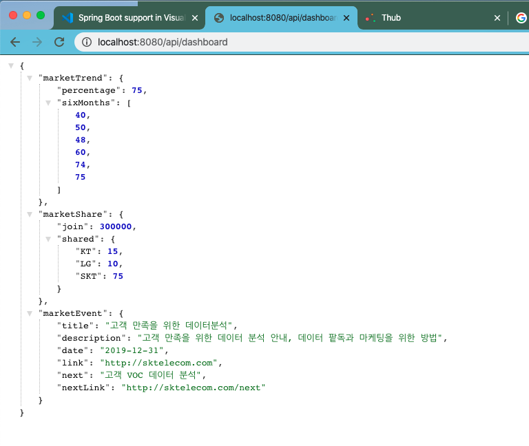

# 서버 사이드 개발하기.

이번에는 서버사이드 프로젝트를 하나 생성하겠습니다.

서버 사이드의 경우 프런트엔드 사이드에서 API 를 통해서 리소스를 요청하여 결과를 받아갈 수 있도록 API 를 공개하도록 개발이 됩니다.

일반적으로 REST API 를 주로 이용합니다.

## 서버사이드 시나리오 작성하기.

우리 통신사를 사용하는 데이터를 먼저 표현하고, 전체 통신사의 비율을 표시하는 두번재 차트, 마지막으로 현재 인기있는 마케팅을 노출한다고 가정하여 지표를 위한 API 가 필요합니다.

테이블 데이터로는 일자별 가입상품 및 연령, 가입 휴대폰 모델을 을 노출하는 API 가 필요할 것입니다.

### API 목록 확인하기.

| URI                      | HTTP Method | Description                        | IN                                                                                                           | OUT                                                                                                                                                                                                                                                                                                                                                                                                                                                                                                                                                                                                |
| :----------------------- | :---------- | :--------------------------------- | :----------------------------------------------------------------------------------------------------------- | :------------------------------------------------------------------------------------------------------------------------------------------------------------------------------------------------------------------------------------------------------------------------------------------------------------------------------------------------------------------------------------------------------------------------------------------------------------------------------------------------------------------------------------------------------------------------------------------------- |
| /api/dashboard           | GET         | 대시보드 지표 데이터를 요청한다.   | None                                                                                                         | {<br/> market-trend: {percentage: 75, six-months: [50, 60, 55, 71, 70, 75]},<br/> market-share: {join: 300000, shared: {S: 75, K: 15, L: 10}},<br/> market-event: {title: "고객 만족을 위한 데이터분석", description: "고객 만족을 위한 데이터 분석 안내, 데이터 팥독과 마케팅을 위한 방법", date: "2019-12-30", link:"/article/200123", next: "고객 VOC 데이터 분석", next-link: "/article/2033223"}<br/>}                                                                                                                                                                                        |
| /api/dashboard/join-info | GET         | 대시보드 테이블 데이터를 요청한다. | {<br/>from: "2019-12-30", <br/> to: "2019-12-31", <br/> order: "LATEST \| OLDEST", <br/> product:"S9" <br/>} | {<br/> page: <br/>{pageno: 1, row: 10, total: 100}, <br/>datas: <br/>[ <br/>{no: 1, id: 11112, product: "행복모아", model: "S10", age: 25}, <br/>{no: 2, id: 11113, product: "가족모아1", model: "S9", age: 30}, <br/>{no: 3, id: 11114, product: "가족모아2", model: "IPhoneX", age: 19}, <br/>{no: 4, id: 11115, product: "가족모아3", model: "S8", age: 17}, <br/>{no: 5, id: 11116, product: "나눔행복", model: "Note9", age: 45}, <br/>{no: 6, id: 11117, product: "행복모아1", model: "IPhone11", age: 35}, <br/>{no: 7, id: 11118, product: "행복모아2", model: "S10", age: 50}<br/>]<br/>} |

위 테이블 내역과 같이 Dashboard 를 위해서 2개의 API 를 만들었습니다.

대시보드 지표데이터와 가입 목록 리스트를 보고, 검색할 수 있는 항목입니다.

## 서버 개발하기.

우리의 서버는 가장 일반적으로 사용되고 있는 Spring Boot 를 이용하여 개발해 보도록 하겠습니다.

### 프로젝트 생성하기.

스프링 부트 프로젝트 생성은 [https://start.spring.io](https://start.spring.io) 에서 생성하는 것이 가장 효과적입니다.


위와 같이 설정을 하고 Generagte 버튼을 클릭해 줍니다.

해당 소스를 클릭하면 소스 템플릿이 다운로드 됩니다.

## 서버 디렉토리 구조 확인하기.

일단 서버 디렉토리 구조를 확인해 보겠습니다.

- pom.xml: Maven 의존성 관리 파일입니다. 이 파일을 통해서 필요한 의존성을 관리할 수 있고, 프로젝트 빌드등 소스 관리를 할 수 있습니다.
- src
  - main: 실제 개발돠는 소스가 저장됩니다.
    - com.sktelecom.uxstudio.sample.uxstudiosample: 패키지와 매칭되는 디렉토리입니다.
      - UxstudioSampleApplication.java: 샘플을 위한 어플리케이션으로 어플리케이션 실행을 위한 엔트리 포인트 소스 입니다.
    - resources:
      - static: 정적 리소스를 저장할 수 있는 디렉토리 위치입니다.
      - templates: WEB MVC 에서 View 를 노출할 수 있는 템플릿 소스를 저장하는 위치입니다.
      - application.properties: 어플리케이션 설정을 위한 속성파일이 저장됩니다.
        - application-{dev\|prod}.properties 등으로 환경에 따른 속성을 달리 지정할 수 있습니다.
  - test: 테스트 코드가 저장되는 디렉토리입니다.
    - com.sktelecom.uxstudio.sample.uxstudiosample: 패키지와 매칭되는 디렉토리입니다. 이는 main 과 동일하게 일반적으로 작성합니다.
      - UxstudioSampleApplicationTests.java: 테스트 파일입니다.
- target: 컴파일이 된 결과를 저장합니다.

## 실행해보기.

샘플을 실행하는 방법은 여러가지가 있지만, IDE 를 이용하는 방법이 가장 편리합니다.

저의 경우 Visual Studio Code 를 이용하기 때문에 [https://code.visualstudio.com/docs/java/java-spring-boot](https://code.visualstudio.com/docs/java/java-spring-boot) 에서 스프링 부트를 위한 Extension 을 설치하고 아래와 같이 실행할 수 있습니다 .


실행하면 아래와 같이 실행 결과가 나타납니다.


웹이 실행되었기 때문에 http 로 접속할 수 있습니다.

http://localhost:8080/ 으로 접속하면 다음과 같은 화면이 나타납니다.


위와 같이 오류가 나타납니다. 당연히 REST API 에 접속할 엔드포인트가 없기 때문에 이러한 404 오류가 나는 것입니다.

## endpoint 코드 작성하기.

우리는 이전에 `/api/dashboard` GET 과 `/api/dashboard/join-info` GET 으로 2개를 작성하면 됩니다.

일단 Controller 을 만들어야겠죠?

`src/main/java/com/sktelecom/uxstudio/sample/uxstudiosample/dashboard/DashboardController.java` 와 같이

DashboardController.java 파일을 하나 만들어 줍니다.

```
package com.sktelecom.uxstudio.sample.uxstudiosample.dashboard;

import org.springframework.web.bind.annotation.GetMapping;
import org.springframework.web.bind.annotation.RequestMapping;
import org.springframework.web.bind.annotation.RestController;

/**
 * DashboardController
 */
@RestController
@RequestMapping("/api/dashboard")
public class DashboardController {

    @GetMapping
    public String mainDashboard() {
        return "{uri: '/'}";
    }

    @GetMapping("/join-info")
    public String joinInfo() {
        return "{uri: 'join-info'}";
    }

}
```

위와 같은 소스를 작성해 주고 다시 실행해보겠습니다.

### 결과화면보기

http://localhost:8080/api/dashboard 을 브라우저에서 열어보면 다음과 같이 결과가 나타납니다 .


http://localhost:8080/api/dashboard/join-info 을 브라우저에서 열어보면 다음과 같이 결과가 나타납니다 .


기본적으로 엔드포인트가 동작함을 확인하였습니다.

## 반환코드 추가하기.

이제 엔드포인트를 만들어 주었기 때문에, 이제는 실제로 의미있는 데이터를 반환하도록 해보겠습니다.

참고로 우리는 엔드포인트를 정상적으로 노출하는 작업을 먼저해야하므로, 이젠에 저장한 임시 데이터를 노출하도록만 작업해줍니다.

### /api/dashboard 를 위한 응답값 만들어주기

{<br/> market-trend: {percentage: 75, six-months: [50, 60, 55, 71, 70, 75]},<br/> market-share: {join: 300000, shared: {S: 75, K: 15, L: 10}},<br/> market-event: {title: "고객 만족을 위한 데이터분석", description: "고객 만족을 위한 데이터 분석 안내, 데이터 팥독과 마케팅을 위한 방법", date: "2019-12-30", link:"/article/200123", next: "고객 VOC 데이터 분석", next-link: "/article/2033223"}<br/>}

위와 같은 응답값이 출력되어야합니다.

이러한 응답을 단일 텍스트로 작업해 주어도 되지만 객체를 만들어서 반환해 보겠습니다.

위 구조를 먼저 확인해봐야합니다.

- market-trend
  - percentage: Integer
  - six-months: Integer[]
- market-share
  - join: Long
  - shared: Map<String, int>
- market-event
  - title: String
  - description: String
  - link: String
  - next: String
  - next-link: String

이 코드를 만들기 위해서는 MarketTrend.java, MarketShare.java, MarketEvent.java 파일을 각각 만들어 주면 됩니다.

그리고 이 모든 객체를 담기 위해서 DashboardData.java 를 만들어 줍니다.

src/main/java/com/sktelecom/uxstudio/sample/uxstudiosample/dashboard/MarketTrend.java

```
package com.sktelecom.uxstudio.sample.uxstudiosample.dashboard;

/**
 * MarketTrend
 */

public class MarketTrend {

    private int percentage;

    private int[] sixMonths;

    public int getPercentage() {
        return percentage;
    }

    public void setPercentage(int percentage) {
        this.percentage = percentage;
    }

    public int[] getSixMonths() {
        return sixMonths;
    }

    public void setSixMonths(int[] sixMonths) {
        this.sixMonths = sixMonths;
    }

    public MarketTrend(int percentage, int[] sixMonths) {
        this.percentage = percentage;
        this.sixMonths = sixMonths;
    }

    public MarketTrend() {
    }

}
```

src/main/java/com/sktelecom/uxstudio/sample/uxstudiosample/dashboard/MarketShare.java

```
package com.sktelecom.uxstudio.sample.uxstudiosample.dashboard;

import java.util.HashMap;

/**
 * MarketShare
 */
public class MarketShare {

    private Long join;

    private HashMap<String, Integer> shared;

    public Long getJoin() {
        return join;
    }

    public void setJoin(Long join) {
        this.join = join;
    }

    public HashMap<String, Integer> getShared() {
        return shared;
    }

    public void setShared(HashMap<String, Integer> shared) {
        this.shared = shared;
    }

    public MarketShare(Long join, HashMap<String, Integer> shared) {
        this.join = join;
        this.shared = shared;
    }

    public MarketShare() {
    }

}
```

src/main/java/com/sktelecom/uxstudio/sample/uxstudiosample/dashboard/MarketEvent.java

```
package com.sktelecom.uxstudio.sample.uxstudiosample.dashboard;

/**
 * MarketEvent
 */
public class MarketEvent {

    private String title;
    private String description;
    private String date;
    private String link;
    private String next;
    private String nextLink;

    public String getTitle() {
        return title;
    }

    public void setTitle(String title) {
        this.title = title;
    }

    public String getDescription() {
        return description;
    }

    public void setDescription(String description) {
        this.description = description;
    }

    public String getDate() {
        return date;
    }

    public void setDate(String date) {
        this.date = date;
    }

    public String getLink() {
        return link;
    }

    public void setLink(String link) {
        this.link = link;
    }

    public String getNext() {
        return next;
    }

    public void setNext(String next) {
        this.next = next;
    }

    public String getNextLink() {
        return nextLink;
    }

    public void setNextLink(String nextLink) {
        this.nextLink = nextLink;
    }

    public MarketEvent(String title, String description, String date, String link, String next, String nextLink) {
        this.title = title;
        this.description = description;
        this.date = date;
        this.link = link;
        this.next = next;
        this.nextLink = nextLink;
    }

    public MarketEvent() {
    }

}
```

src/main/java/com/sktelecom/uxstudio/sample/uxstudiosample/dashboard/DashboardData.java 으로 위 내용을 모두 담아주는 객체를 만듭니다 .

```
package com.sktelecom.uxstudio.sample.uxstudiosample.dashboard;

/**
 * DashboardData
 */
public class DashboardData {

    private MarketTrend marketTrend;

    private MarketShare marketShare;

    private MarketEvent marketEvent;

    public MarketTrend getMarketTrend() {
        return marketTrend;
    }

    public void setMarketTrend(MarketTrend marketTrend) {
        this.marketTrend = marketTrend;
    }

    public MarketShare getMarketShare() {
        return marketShare;
    }

    public void setMarketShare(MarketShare marketShare) {
        this.marketShare = marketShare;
    }

    public MarketEvent getMarketEvent() {
        return marketEvent;
    }

    public void setMarketEvent(MarketEvent marketEvent) {
        this.marketEvent = marketEvent;
    }

    public DashboardData(MarketTrend marketTrend, MarketShare marketShare, MarketEvent marketEvent) {
        this.marketTrend = marketTrend;
        this.marketShare = marketShare;
        this.marketEvent = marketEvent;
    }

    public DashboardData() {
    }

}
```

그리고 다음으로 DashboardController.java 파일을 다음과 같이 수정합니다.

```
package com.sktelecom.uxstudio.sample.uxstudiosample.dashboard;

import org.springframework.web.bind.annotation.GetMapping;
import org.springframework.web.bind.annotation.RequestMapping;
import org.springframework.web.bind.annotation.RestController;
import java.util.HashMap;

/**
 * DashboardController
 */
@RestController
@RequestMapping("/api/dashboard")
public class DashboardController {

    @GetMapping
    public DashboardData mainDashboard() {

        return new DashboardData(createThrendValue(), createMarketShare(), createMarketEvent());
    }

    @GetMapping("/join-info")
    public String joinInfo() {
        return "{uri: 'join-info'}";
    }

    public MarketTrend createThrendValue() {

        int[] trendValue = { 40, 50, 48, 60, 74, 75 };

        MarketTrend trend = new MarketTrend();
        trend.setPercentage(75);
        trend.setSixMonths(trendValue);

        return trend;
    }

    public MarketShare createMarketShare() {

        HashMap<String, Integer> shareInfo = new HashMap<>();
        shareInfo.put("SKT", 75);
        shareInfo.put("KT", 15);
        shareInfo.put("LG", 10);

        MarketShare share = new MarketShare();
        share.setJoin(300000L);
        share.setShared(shareInfo);

        return share;
    }

    public MarketEvent createMarketEvent() {

        MarketEvent event = new MarketEvent();
        event.setTitle("고객 만족을 위한 데이터분석");
        event.setDescription("고객 만족을 위한 데이터 분석 안내, 데이터 팥독과 마케팅을 위한 방법");
        event.setLink("http://sktelecom.com");
        event.setNext("고객 VOC 데이터 분석");
        event.setNextLink("http://sktelecom.com/next");
        event.setDate("2019-12-31");
        return event;
    }
}

```

간단하게만 REST API 를 작성할 것이기 때문에 위와같이 Controller 에 모든것을 추가했습니다.

#### 결과보기



결과를 보면 우리가 원하는 형태의 계층구조를 가진 JSON 으로 노출되는 것을 알 수 있습니다.

### /api/dashboard/join-info 를 위한 응답값 만들어주기

이번에는 가입 정보를 일자별로 나타내는 API 를 구체적으로 작성할 차례입니다.

여기서도 가입정보를 List 로 반환하도록 하겠습니다.

- JoinInfos
  - Page
  - JoinInfo

위 형태로 정보를 내려 보냅니다.

src/main/java/com/sktelecom/uxstudio/sample/uxstudiosample/dashboard/Page.java

```
package com.sktelecom.uxstudio.sample.uxstudiosample.dashboard;

/**
 * Page
 */
public class Page {
    private int pageNo;
    private int row;
    private Long total;

    public int getPageNo() {
        return pageNo;
    }

    public void setPageNo(int pageNo) {
        this.pageNo = pageNo;
    }

    public int getRow() {
        return row;
    }

    public void setRow(int row) {
        this.row = row;
    }

    public Long getTotal() {
        return total;
    }

    public void setTotal(Long total) {
        this.total = total;
    }

    public Page() {
    }

    public Page(int pageNo, int row, Long total) {
        this.pageNo = pageNo;
        this.row = row;
        this.total = total;
    }

    @Override
    public String toString() {
        return "Page [pageNo=" + pageNo + ", row=" + row + ", total=" + total + "]";
    }

}

```

src/main/java/com/sktelecom/uxstudio/sample/uxstudiosample/dashboard/JoinInfo.java

```
package com.sktelecom.uxstudio.sample.uxstudiosample.dashboard;

/**
 * JoinInfo
 */
public class JoinInfo {

    private Long no;
    private Long id;
    private String productName;
    private String model;
    private int age;

    public Long getNo() {
        return no;
    }

    public void setNo(Long no) {
        this.no = no;
    }

    public Long getId() {
        return id;
    }

    public void setId(Long id) {
        this.id = id;
    }

    public String getProductName() {
        return productName;
    }

    public void setProductName(String productName) {
        this.productName = productName;
    }

    public String getModel() {
        return model;
    }

    public void setModel(String model) {
        this.model = model;
    }

    public int getAge() {
        return age;
    }

    public void setAge(int age) {
        this.age = age;
    }

    public JoinInfo(Long i, Long j, String productName, String model, int age) {
        this.no = i;
        this.id = j;
        this.productName = productName;
        this.model = model;
        this.age = age;
    }

    public JoinInfo() {
    }

}
```

src/main/java/com/sktelecom/uxstudio/sample/uxstudiosample/dashboard/JoinInfos.java

```
package com.sktelecom.uxstudio.sample.uxstudiosample.dashboard;

import java.util.List;

/**
 * JoinInfos
 */
public class JoinInfos {

    private Page page;

    private List<JoinInfo> joinInfos;

    public Page getPage() {
        return page;
    }

    public void setPage(Page page) {
        this.page = page;
    }

    public List<JoinInfo> getJoinInfos() {
        return joinInfos;
    }

    public void setJoinInfos(List<JoinInfo> joinInfos) {
        this.joinInfos = joinInfos;
    }

    public JoinInfos(Page page, List<JoinInfo> joinInfos) {
        this.page = page;
        this.joinInfos = joinInfos;
    }

    public JoinInfos() {
    }

    @Override
    public String toString() {
        return "JoinInfos [joinInfos=" + joinInfos + ", page=" + page + "]";
    }

}
```

위와 같이 반환 데이터를 세팅합니다.

입력 조건값은 아래와 같이 작업해줍니다.

src/main/java/com/sktelecom/uxstudio/sample/uxstudiosample/dashboard/SearchCondition.java

```
package com.sktelecom.uxstudio.sample.uxstudiosample.dashboard;

/**
 * SearchCondition
 */
public class SearchCondition {

    private String from;
    private String to;
    private String order;
    private String product;

    private Page page;

    public String getFrom() {
        return from;
    }

    public void setFrom(String from) {
        this.from = from;
    }

    public String getTo() {
        return to;
    }

    public void setTo(String to) {
        this.to = to;
    }

    public String getOrder() {
        return order;
    }

    public void setOrder(String order) {
        this.order = order;
    }

    public String getProduct() {
        return product;
    }

    public void setProduct(String product) {
        this.product = product;
    }

    public Page getPage() {
        return page;
    }

    public void setPage(Page page) {
        this.page = page;
    }

    public SearchCondition(String from, String to, String order, String product, Page page) {
        this.from = from;
        this.to = to;
        this.order = order;
        this.product = product;
        this.page = page;
    }

    public SearchCondition() {
    }

    @Override
    public String toString() {
        return "SearchCondition [from=" + from + ", order=" + order + ", page=" + page + ", product=" + product
                + ", to=" + to + "]";
    }

}
```

그리고 컨트롤러를 다음과 같이 수정해보겠습니다.

DashboardController.java

```
    @GetMapping("/join-info")
    public JoinInfos joinInfo(SearchCondition searchCondition) {
        return createJoinInfos(searchCondition);
    }

    private JoinInfos createJoinInfos(SearchCondition searchCondition) {
        JoinInfos joinInfos = new JoinInfos();
        searchCondition.getPage().setTotal(100L);
        joinInfos.setPage(searchCondition.getPage());
        joinInfos.setJoinInfos(createJoinInfos());
        return joinInfos;
    }

    private List<JoinInfo> createJoinInfos() {
        List<JoinInfo> joinInfos = new ArrayList<>();
        joinInfos.add(new JoinInfo(1L, 1111L, "가족모아1", "S10", 20));
        joinInfos.add(new JoinInfo(2L, 1112L, "가족모아2", "S10", 40));
        joinInfos.add(new JoinInfo(3L, 1113L, "친구모아", "S10", 45));
        joinInfos.add(new JoinInfo(4L, 1114L, "남사친", "S10", 35));
        joinInfos.add(new JoinInfo(5L, 1115L, "여사친", "S10", 25));
        joinInfos.add(new JoinInfo(6L, 1116L, "어린친구모아", "S10", 15));

        return joinInfos;
    }
```

joinInfo 메소드는 SearchCondition 을 파라미터로 받습니다.

스프링 부트는 자동으로 queryString 을 분석해서 SearchCondition 에 세팅해줍니다.

```
http://localhost:8080/api/dashboard/join-info?from=1234&to=1233&order=ASC&product=%22S10%22&page.pageNo=10&page.row=10

이렇게 요청을 한다면 다음과 같이 매핑됩니다.

SearchCondition [from=1234, order=ASC, page=Page [pageNo=10, row=10, total=null], product="S10", to=1233]

```

### 결과 확인하기.

결과를 확인해보면 다음과 같이 우리가 원하는 형태로 값이 반환됨을 확인 할 수 있습니다.


이제 서버 프로그래밍은 대충 끝이났습니다.

이렇게 간단한 테스트용 REST API 를 만들때는 임시 데이터를 클라이언트에 내려보내주고, 클라이언트 작업과, 서버 작업을 병행으로 개발 할 수 있습니다.

이렇게 하면 서버를 기다리지 않고 프런트엔드는 자신의 작업을 할 수 있으므로 개발을 빠르게 진행할 수 있습니다.

완벽한 서버 프로그램을 만들기 위해서 처음부터 노력할 필요가 없습니다. (이러한 업무 방식은 실제로 프로젝트에 많은 도움을 줍니다.)
