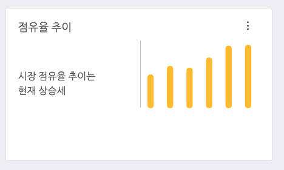

# Client & Server 연동하기.

이제 클라이언트가 서버로 부터 데이터를 받아서 화면을 그려주는 작업을 할 차례입니다.

React 버젼으로 작업을 수행하기 위해서 우리는 Redux, Redux-Saga 를 이용할 예정입니다.

Redux 는 state 를 관리하기 위한 방법을 제공하기 위해 사용합니다.

그리고 Redux-Saga 는 서버 요청을 비동기로 요청하여 클라이언트의 렌더링 작업을 효과적으로 수행해주게 해주기 위해 사용합니다.

- 참고: UXStudio Package 는 기본적으로 Redux 와 Redux-Saga 를 사전에 탑재하고 있습니다.

## 관리 스테이트 알아보기.

Redux 를 이용한다는 것은 하나의 위치에서 state 를 관리한다는 의미입니다.

state 는 Single Page Application 내에서 관리할 데이터를 나타냅니다.

그럼 어떠한 state 를 관리하는 것이 좋을까요?

이미 알고 계시겠지만 다음과 같은 데이터를 관리하면 될 것입니다.

- 대시보드 지표 영역
  - 트랜드 분석 데이터
    - 점유율: percentage
    - 점유율 추이: 6개월간 점유율 배열
  - 시장 점유율 데이터
    - 현재 가입자수: join
    - 기업간 시장 점유율: SKT, KT, LG 등의 점유율을 알 수 있습니다.
  - 이벤트 데이터
    - 이벤트제목
    - 설명
    - 이벤트등록일
    - 이벤트링크
    - 다음이벤트제목
    - 다임이벤트링크
- 일별 가입 데이터
  - 검색정보
    - 현재 페이징 정보
      - 페이지번호
      - 한페이지당 row 수
      - 총 페이지수
    - 시작일
    - 종료일
    - 정룔기준
  - 가입정보 배열
    - 가입정보
      - 번호
      - 아이디
      - 제품명
      - 모델명
      - 나이

우리는 위 계층구조를 가진 데이터를 state 로 관리할 것입니다.

위 데이터를 관리하게 되면 SPA 에서 각 컴포넌트에 데이터를 주입하는 일관적인 정보를 관리할 수 있습니다.

## state 정보 분리하기.

자세히 살펴보면 state 정보는 대시보드 지표영역과 일별 가입정보 영역으로 2개로 나뉘어지며, 실제 데이터의 특성도 다릅니다.

- 지표영역: 현재 시간 기준으로 데이터를 나타냅니다.
- 일별 가입정보: 검색에 따른 가입 목록을 보여줍니다.

우리는 이때 ducks 패턴을 사용하여 2개의 리듀서로 분리해서 관리하면, 좀더 관리가 편한 소스코드를 작성할 수 있습니다.

### 대시보드 지표영역 ducks 패턴 적용하기.

일별 가입정보를 위한 리듀서 파일을 하나 만들겠습니다.

덕스 패턴을 그대로 이용할 것이기 때문에, 액션, 디스패처, 리듀서 모두 하나의 파일에 만듭니다.

src/pages/dashboardDataReducer.js 파일을 하나 만들어 줍니다.

```
// immer 의 경우 리덕스 사용시, state 를 완전 함수를 통해 수정할 수 있는 편리한 기능을 제공해주는 모듈입니다.
import produce from "immer";

// ActionType 작성, 아직 액션들을 명확히 지정할 필요가 없으므로 REFRESH 정도만 추가해 줍니다.
const REFRESH = "REFRESH";

// Action 작성 액션은 사용자의 이
export const refresh = () => ({ type: REFRESH, payload: initialState });

// 초기 상태 작성 (초기 렌더링이 준비되는경우 상태값을 redux 상태로 변경한다. )
export const initialState = {
  marketTrend: {
    percentage: 75,
    sixMonths: [40, 50, 48, 60, 74, 75]
  },
  marketShare: {
    join: 300000,
    shared: {
      KT: 15,
      LG: 10,
      SKT: 75
    }
  },
  marketEvent: {
    title: "고객 만족을 위한 데이터분석",
    description:
      "고객 만족을 위한 데이터 분석 안내, 데이터 팥독과 마케팅을 위한 방법",
    date: "2019-12-31",
    link: "http://sktelecom.com",
    next: "고객 VOC 데이터 분석",
    nextLink: "http://sktelecom.com/next"
  }
};

// 리듀서 작성, 리듀서를 작성하여 액션타입에 따라 동작하도록 코드를 추가해 줍니다.
export default (state = initialState, action) =>
  produce(state, draft => {
    switch (action.type) {
      case REFRESH: {
        draft = action.payload;
        return;
      }
      default: {
        return;
      }
    }
  });

```

### 일별 가입정보 ducks 패턴 적용하기.

이번에는 아래 검색과 테이블 영역에 노출할 리덕스 개체를 만들어 줍니다 .

src/pages/dashboardJoinDataReducer.js 파일을 만들어 줍니다.

```
import produce from "immer";

// ActionType 작성
const SEARCH = "SEARCH";

// Action 작성, 임시적으로 검색이 되었을때 동작할 액션을 만듭니다.
export const refresh = () => ({ type: SEARCH, payload: initialState });

// 초기 상태 작성, 이전 REST API 에서 만든 데이터 자료형을 초기화 해줍니다.
// 원래는 객체를 비워주면 되지만, 우리는 샘플 예제를 위해서 임시 데이터를 세팅 해 주었습니다.
export const initialState = {
  page: { pageno: 1, row: 10, total: 100 },
  datas: [
    { no: 1, id: 11112, product: "행복모아", model: "S10", age: 25 },
    { no: 2, id: 11113, product: "가족모아1", model: "S9", age: 30 },
    {
      no: 3,
      id: 11114,
      product: "가족모아2",
      model: "IPhoneX",
      age: 19
    },
    { no: 4, id: 11115, product: "가족모아3", model: "S8", age: 17 },
    { no: 5, id: 11116, product: "나눔행복", model: "Note9", age: 45 },
    {
      no: 6,
      id: 11117,
      product: "행복모아1",
      model: "IPhone11",
      age: 35
    },
    { no: 7, id: 11118, product: "행복모아2", model: "S10", age: 50 }
  ]
};

// 리듀서 작성
export default (state = initialState, action) =>
  produce(state, draft => {
    switch (action.type) {
      case SEARCH: {
        draft = action.payload;
        return;
      }
      default: {
        return;
      }
    }
  });

```

### combine reducer 생성하기.

지금까지 리듀서를 만들었다면, 이제는 이 리듀서를 사용할 수 있도록 combineReducer 로 리듀서들을 묶어줍니다.

src/pages/index.js 파일 내용을 아래와 같이 설정해줍니다 .

```
import { combineReducers } from "redux";
import pages from "./pagesReducer";
import dashboardInfo from "./dashboardDataReducer";
import dashboardJoinData from "./dashboardJoinDataReducer";

export { default as Welcome } from "./Welcome";

export default combineReducers({
  pages,
  dashboardInfo: dashboardInfo,
  dashboardJoinData: dashboardJoinData
});

```

dashboardInfo 와 dashboardJoinData 를 임포트하고, combineReducer 에 key,value 로 값을 세팅합니다.

키 값을 실제 컴포넌트에서 참조 변수로 이용하기 때문에 너무 길다면 짧게 만들어 주시면 됩니다.

## Redux 이용하여 Dashboard 에 적용하기.

src/pages/dashboard/Dashboard3.js 파일에서 다음과 같은 작업을 해주세요.

### 커넥트로 리덕스와 컴포넌트 상호 연결하기.

```

...
function mapStateToProps(state) {
  console.log("state: ", state);
  return {
    dashboardInfo: state.pages.dashboardInfo,
    joinData: state.pages.dashboardJoinData
  };
}

// export default Dashboard3;
export default connect(mapStateToProps, null)(Dashboard3);
```

위와 같이 mapStateToProps 메소드는 리덕스 state 를 Props 에 매핑한다는 의미입니다.

React 에서 컴포넌트간의 상태값이나 액션들은 props 를 이용하여 전달하기 때문에 위와 같이 mapStateToProps 를 작성합니다.

connect 는 상태와, dispatch (액션) 을 파라미터로 받습니다.

그리고 (Dashboard3) 이라는 부분은 state와 dispatch 를 연동할 컴포넌트를 알려줍니다.

이렇게 되면 Dashboard3 컴포넌트에서 dashboardInfo, joinData 라는 파라미터를 전달하게 됩니다.

### 프로퍼티 출력해보기

이제 연동된 프로퍼티를 출력해볼 차례입니다.

```
...

const Dashboard3 = ({ dashboardInfo, joinData }) => {
  console.log("Dashboard:", dashboardInfo);
  console.log("JoinData:", joinData);

  ...
```

위처럼 파라미털르 전달할 수 있고 출력해보면, 이전 reducer 에 초기화한 initalState 값이 콘솔에 출력이 됩니다.


이제 우리는 편리하게 Dashboard3 Component 에서 편리하게 state 를 이용할 수 있습니다.

### 대시보드 차트에 값 추가하기.

이제 대시보드내에서 필요한 항목에 값을 하나씩 추가하면 됩니다.

그리고 적절한 텍스트로 변경해 줍니다.

```
... 생략

// 첫번재 대시보드의 바 차트용 데이터를 추출한다.
  const trendSixMonths = dashboardInfo.marketTrend.sixMonths;

// 추출한 데이터를 차트내 data: trendSixMonths 로 값을 세팅하빈다.
  const getDashboard3BarChartData = () => ({
    labels: ["", "", "", "", "", ""],
    datasets: [
      {
        data: trendSixMonths,
        backgroundColor: [
          lightColorSet.chartColorSeq5[0],
          lightColorSet.chartColorSeq5[0],
          lightColorSet.chartColorSeq5[0],
          lightColorSet.chartColorSeq5[0],
          lightColorSet.chartColorSeq5[0],
          lightColorSet.chartColorSeq5[0]
        ],
        borderWidth: 0
      }
    ]
  });

... 생략
```



두 번째 대시보드를 데이터를 변경해 줍니다.

```
// 두번째 파이차트를 위한 값을 아래와 같이 세팅해 줍니다.
  var shareLabels = [];
  var shareData = [];

// 대시보드의 값을 키, 값으로 추출하고, 각각 배열에 추가해줍니다.
  for (const [key, value] of Object.entries(dashboardInfo.marketShare.shared)) {
    shareLabels.push(key);
    shareData.push(value);
  }

// 로그로 일단 찍어 봅니다.
  console.log("shareLabels: ", shareLabels);
  console.log("shareData: ", shareData);

  const getDashboard3DoughnutChartData = () => ({
    datasets: [
      {
        data: shareData,    // 실제 데이터를 세팅합니다.
        backgroundColor: [
          lightColorSet.chartColorCategory5_6[0],
          lightColorSet.chartColorCategory5_6[2],
          lightColorSet.chartColorCategory5_6[4]
        ]
      }
    ],

    labels: shareLabels     // 레이블을 설정해줍니다.
  });
```

위와 같이 각각 대시보드의 값을 설정했습니다. 결과를 확인해보면 다음과 같이 변경됩니다.


## 테이블 데이터 출력하기

테이블 데이터는 joinData 내의 데이터를 사용합니다. 

이 데이터를 이용하기 위해서 테이블 정보를 아래와 같이 바꿔 줍니다. 

```
... 생략
  const columns = [
    {
      dataField: "no",
      text: "#"
    },
    {
      dataField: "id",
      text: "#"
    },
    {
      dataField: "product",
      text: "상품명"
    },
    {
      dataField: "model",
      text: "모델명"
    },
    {
      dataField: "age",
      text: "나이"
    }
  ];

  const getData = () => {
    return joinData.datas;
  };

  const products = getData();
... 생략
```

테이블 형태가 위와 같으므로 값을 세팅해 줍니다. 


이렇게 테이블 데이터로 자동으로 설정이 됩니다. 

지금까지 리덕스를 이용하여 컴포넌트에 값을 세팅해 보았습니다. 

리덕스 상태값을 반영하기 위해서는 다음과정을 거치면 됩니다. 

1. ducks 패턴을 통해서 reducer 파일을 생성합니다. 
2. reducer 을 combineReducer 을 이용하여 컴바인 해줍니다 .
3. 컴포넌트에서 connect(mapStateToProps, mapDispatchToProps)(컴포넌트) 을 이용하여 컴포넌트에 리듀서를 설정해줍니다. 
4. 컴포넌트는 props 로 state 값을 전달받고, 컴포넌트에 상태값을 적절한 위치에서 이용해줍니다. 
5. 기타 필요한 이벤트가 밸생하면 리듀서에서 택션에 따라 state 를 변경해주면 됩니다. 

리덕스는 액션이 동기식으로 동작합니다. 

동기식은 사이드 이펙을 만들지 않지만 성능이 느리거나, 가끔 상태 변경상의 이슈가 생겨 프로그램에 오류가 발생하기도 합니다.

이를 쉽게 해결하는 redux-saga 를 이용하여 비동기를 이용하는 방법을 다음에 알아보겠습니다. 