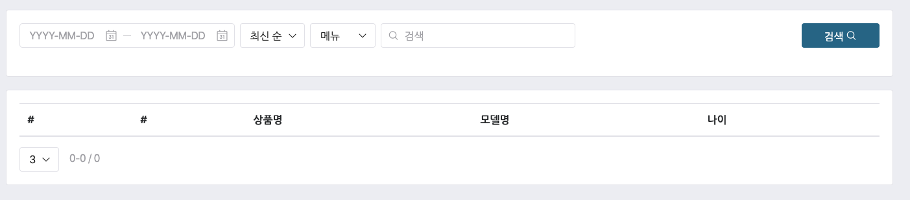
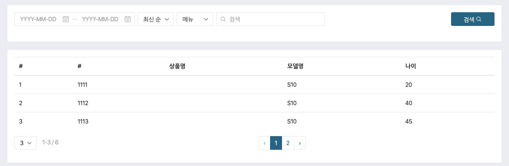

# Client & Server 연동하기 2 / Redux-Saga 이용하여 비동기로 서버 데이터 불러오기

이번에는 redux-saga 를 이용하여 서버 데이터를 로드하여 테이블에 노출하는 것에 대해서 알아보겠습니다.

## 리듀서를 saga 와 연동하기.

redux-saga 는 비동기 데이터 패치와 갱신을 수행하도록 해주는 기능입니다.

### 모듈 설치하기

우리는 redux-saga 모듈과 axios 를 설치하도록 하겠습니다.

axios 는 서버의 데이터를 패치해오는 기능을 수행합니다.

```
npm install redux-saga axios
```

설치가 왼료되었다면 이제는 reducer 를 고칠 차례 입니다 .

### reducer 고치기

테이블 데이터를 호출 해 올것이기 때문에 다음 파일을 수정해 줍니다.

src/pages/dashboardJoinDataReducer.js

```
/* eslint-disable no-param-reassign */
import produce from "immer";

// 서버로부터 데이터를 패치해오는 역할을 하는 axios 를 임포트 합니다.
import axios from "axios";

// saga 에서 put, get, takeLatest, takeEvery, all 등 다양한 메소드를 이용할 수 있습니다.
// https://redux-saga.js.org/docs/api/ 에서 참고하시면 좋습니다.
import { put, takeLatest, all } from "redux-saga/effects";

// ActionType 작성
export const SEARCH = "SEARCH";
export const SEARCH_DONE = "SEARCH_DONE";

export const search_btn_click = () => ({ type: SEARCH });

// Action 작성
export function* searchWatcher() {
  yield takeLatest(SEARCH, search);
}

function* search() {
  const json = yield axios
    .get(
      "http://localhost:8080/api/dashboard/join-info?from=1234&to=1233&order=ASC&product=%22S10%22&page.pageNo=10&page.row=10"
    )
    .then(response => {
      return response;
    });
  yield put({ type: SEARCH_DONE, payload: json.data });
}
// 초기 상태 작성
export const initialState = {
  page: { pageno: 1, row: 10, total: 100 },
  datas: []
};

// 리듀서 작성
export default (state = initialState, action) =>
  produce(state, draft => {
    switch (action.type) {
      case SEARCH_DONE: {
        draft.page = action.payload.page;
        draft.datas = action.payload.joinInfos;
        return;
      }
      default: {
        return;
      }
    }
  });

```

import axios from "axios";

이 코드는 서버 데이터를 패치해오기 위한 모듈을 임포트 합니다.

import { put, takeLatest, all } from "redux-saga/effects";

위 코드는 이벤트가 들어올때 이벤트를 받아들이는 takeLatest 모듈, 다시 saga 로 이벤트를 보내는 put, 마지막으로 모든 이벤트를 하나의 리스트로 묶어주기 위한 all 메소드를 임포트합니다.

```
export const SEARCH = "SEARCH";
export const SEARCH_DONE = "SEARCH_DONE";
```

위와 같이 액션 타입을 2개 만들어 줍니다.

검색 이벤트를 위해서 SEARCH 액션타입, SAGA 를 이용하여 검색 요청을 마친경우를 알리는 SEARCH_DONE 이벤트를 둡니다.

```
export function* searchWatcher() {
  yield takeLatest(SEARCH, search);
}
```

위 코드처럼 SEARCH 액션이 발생하는 경우 watcher 가 이를 캐치합니다.

takeLatest 를 이용하기 때문에 동시에 여러번 클릭이 들어와도 마지막 이벤트만 효력을 발휘합니다.

캐치되면 search 메소드를 호출합니다.

```
function* search() {
  const json = yield axios
    .get(
      "http://localhost:8080/api/dashboard/join-info?from=1234&to=1233&order=ASC&product=%22S10%22&page.pageNo=10&page.row=10"
    )
    .then(response => {
      return response;
    });
  yield put({ type: SEARCH_DONE, payload: json.data });
}
// 초기 상태 작성
export const initialState = {
  page: { pageno: 1, row: 10, total: 100 },
  datas: []
};
```

위 코드는 search 메소드 이며, 서버에서 데이터를 패치해옵니다.

아래 put 메소드를 이용하여 정상적으로 결과를 패치한경우라면 SEARCH_DONE 이벤트를 리듀서로 디스패치 해줍니다.

결과값으로 json 내의 data 객체를 페이로드로 전달합니다.

```
export default (state = initialState, action) =>
  produce(state, draft => {
    switch (action.type) {
      case SEARCH_DONE: {
        draft.page = action.payload.page;
        draft.datas = action.payload.joinInfos;
        return;
      }
      default: {
        return;
      }
    }
  });
```

위 코드는 리듀서 입니다.

SEARCH_DONE 액션 타입을 캐이하고, 페이로드의 페이지, joinInfo 를 초기화 state 에 반영하도록 해줍니다.

immerjs 에서는 state 는 현재 데이터 스테이트를 가지며, draft 는 현재 스테이트의 프록시로 draft 내용을 변경해주면 자동으로 state 의 상태를 바꿔주는 일을 해줍니다.

### rootSaga 로 Saga 묶어주기

Saga 는 연속된 이벤트들의 리스트입니다.

이러한 이벤트를 watch 하는 메소드들을 루트 saga 로 묶어주는 작업을 아래와 같이 해주니다 .

src/pages/sagas.js 파일을 만들고 아래 코드를 작성합니다.

```
import { searchWatcher } from "../pages/dashboardJoinDataReducer";

import { all } from "redux-saga/effects";

export default function* rootSaga() {
  yield all([searchWatcher()]);
}

```

### Saga 미들웨어를 전체 어플리케이션에 적용하기.

이제는 src/store/configure.js 파일을 열어 saga 미들웨어를 생성, 적용, 실행합니다.

```
import { createStore, combineReducers, applyMiddleware } from "redux";

import model from "./model";
import containers from "../containers";
import pages from "../pages";
import { logger } from "redux-logger";
import createSagaMiddleware from "redux-saga";
import rootSaga from "../pages/sagas";

const sagaMiddleware = createSagaMiddleware();

const configureStore = () => {
  const reducers = combineReducers({ model, containers, pages });
  const store = createStore(reducers, applyMiddleware(sagaMiddleware, logger));

  sagaMiddleware.run(rootSaga);

  return store;
};

export default configureStore;

```

일단 rootSata 를 임포트 했습니다.

그리고 createSagaMiddleware 메소드를 이용하여 새로운 saga미들웨어를 생성합니다.

그리고 applyMiddleware 를 이용하여 saga미들웨어를 적용합니다.

sagaMiddleware.run(rootSaga) 는 rootSata 를 실행해주는 역할을 합니다.

그럼 dispatch 된 액션타입을 rootSaga 내의 이벤트 watcher 가 기다리고 있다가 필요한경우 캐치합니다 .

## saga 실제 적용하기. 

우선 리듀서를 임포트 합니다. 

```
import { search_btn_click } from "../dashboardJoinDataReducer";
```

그리고 mapDispatchToProps 메소드를 만들어 컴포넌트에 연동해줍니다. 

```
... 생략 

const mapStateToProps = state => {
  console.log("state: ", state);
  return {
    dashboardInfo: state.pages.dashboardInfo,
    joinData: state.pages.dashboardJoinData
  };
};

const mapDispatchToProps = dispatch => ({
  search_btn_click: () => dispatch(search_btn_click())
});
// export default Dashboard3;
export default connect(mapStateToProps, mapDispatchToProps)(Dashboard3);

```

search_btn_click 이벤트를 mapDispatchToProps 를 이용하여 디스패치 하는 메소드를 만듭니다 .

그리고 connect 의 2번째 파라미터로 전달합니다. 

connect(mapStateToProps, mapDispatchToProps)(적용대상) 이므로 위 코드를 이해하실 수 있습니다. 

### 컴포넌트 파라미터로 props 전달하기 

```
const Dashboard3 = ({ dashboardInfo, joinData, search_btn_click }) => {
    ...


// 버튼 연동해주기 
        <div className="list-before-checked">
        <Button
            className="icon-only"
            style={{ width: 120 }}
            onClick={search_btn_click}
        >
            검색
            <span
            className="glyphicons-search ml-1"
            aria-hidden="true"
            />
        </Button>
        </div>
```

버튼 이벤트인 onClick={search_btn_click} 로 전달된 props 를 그대로 실행해주면 이벤트가 동작합니다. 

## 결과보기

CH3 에서 만든 서버를 실행합니다. 

그리고 localhost:3000 으로 화면을 열어줍니다. 



처음 데이터가 없습니다. 

"검색" 버튼을 클릭하고 결과를 확인합니다. 




보시는 바와 같이 서버에서 데이터를 패치해와서 화면에 노출시켜 주었습니다. 

## 결론

지금까지 redux saga 를 이용하는 법을 알아보았습니다. 

미들웨어를 이용하기 위한 몇가지 파일생성과 코드 작업이 있지만 매우 자연스럽게 상태값을 이용할 수 있다는 것을 확인했습니다. 

최근 리덕스와 saga 는 작은 프로젝트이던, 큰 프로젝트이던 필수 요소가 되고 있습니다. 


