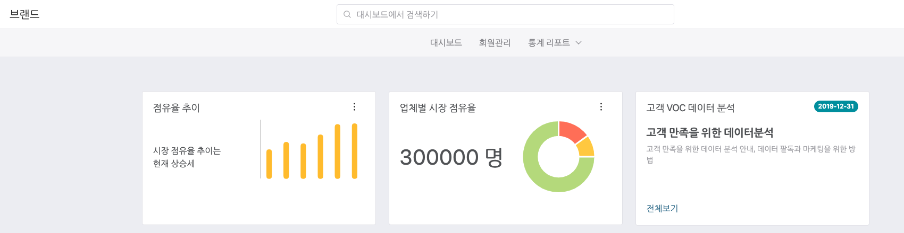
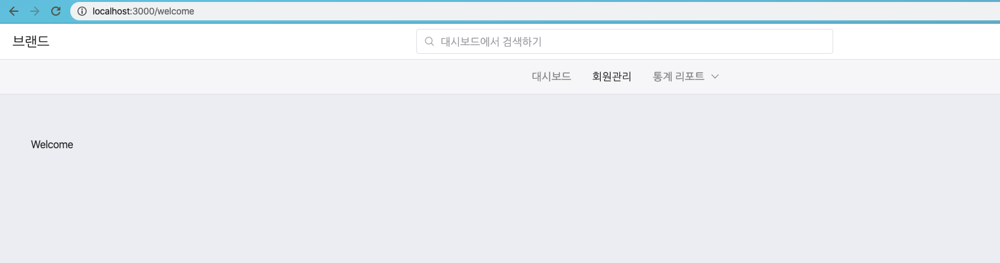

# Routing 으로 네비게이션하기.

이제 남아있는 작업은 Routing 을 이용하여 메뉴를 클릭시 페이지를 라우팅 하는 것입니다.

## 설치

```
npm install react-router-dom react-router-bootstrap
```

위 모듈을 설치합니다.

## 라우팅할 경로 정리하기.

우리는 네비게이션을 통해서 라우팅을 수행할 경로를 하나의 파일에 나열하도록 하겠습니다.

헤당 경로에 파일을 다음과 같이 만들어 줍니다.

src/routerList.js

```
import React from "react";
import ReactDOM from "react-dom";
import { Route, Link, BrowserRouter as Router, Switch } from "react-router-dom";

import Dashboard3 from "./pages/dashboard/Dashboard3";
import Welcome from "./pages/Welcome";
import { Layout3 } from "./containers";

const routing = () => (
  <Router>
    <Layout3>
      <Switch>
        <Route exact path="/" component={Dashboard3} />
        <Route path="/welcome" component={Welcome} />
      </Switch>
    </Layout3>
  </Router>
);

export default routing;

```

위 내용을 보면 react-router-dom 을 이용하여 라우팅 경로를 지정할 수 있도록 임포트 합니다.

그리고 라우팅할 페이지 컴포넌트를 임포트 해줍니다 .

```
import Dashboard3 from "./pages/dashboard/Dashboard3";
import Welcome from "./pages/Welcome";
```

Layout3 은 상단 메뉴를 나타냅니다. 이 메뉴는 화면의 내용이 바뀌어도 메뉴는 바뀌지 않기 때문에 라우터의 밖에 위치 시키기 위해 임포트 합니다.

Router 컴포넌트로 전체 내용을 감싸줍니다.

그리고 제일 상위는 Layout3 컴포넌트가 됩니다.

이후 메뉴에서 변경될 컨텐츠들을 Switch 컴포넌트 하위에 나열해 줍니다 .

```
    <Layout3>
      <Switch>
        <Route exact path="/" component={Dashboard3} />
        <Route path="/welcome" component={Welcome} />
      </Switch>
    </Layout3>
```

이렇게 해주면 Layout3 은 최상위 컴포넌트로 고정되고, Route 라고 된 페이지들이 교체 됩니다.

Switch 는 페이지를 배타적으로 교체하게끔 해줍니다.

exact 는 path 에 나온 경로가 정확할 때만 동작합니다.

path 에는 regex 가 들어오며, 이동하고자 하는 경로를 지정해 주면 됩니다.

component 는 path 에 대한 경로가 들어오면 체인지할 컴포넌트가 됩니다.

## router 가 동작하도록 주입시켜주기.

이제 라우터 컴포넌트가 동작하도록 src/index.js 파일에서 다음과 같이 변경해줍니다.

이전 코드는 Dashboard3 을 바로 사용했다면 이제는 Routing 이라고 아래와 같이 작업해주면 됩니다 .

```
import React from "react";
import ReactDOM from "react-dom";
import { Provider } from "react-redux";
import configureStore from "./store/configure";
import Routing from "./routerList";

const store = configureStore();

ReactDOM.render(
  <Provider store={store}>
    <Routing />
  </Provider>,
  document.getElementById("root")
);

```

## 메뉴를 변경하고 클릭시 이동 시켜주기.

이제는 메뉴를 선택하고, 페이지 이동을 시켜주도록 해봅시다.

src/containers/layout/Layout3.js 파일의 내용을 아래와 같이 바꿔 줍니다.

```
... 생략

import ReactRouterBootstrap, { LinkContainer } from "react-router-bootstrap";

... 생략
// 메뉴 부분을 아래와 같이 바꿔줍니다.
        <div className="gnb d-none d-md-flex">
          <Nav as="ul">
            <Nav.Item as="li">
              <Nav.Link>
                <LinkContainer to="/">
                  <span>대시보드</span>
                </LinkContainer>
              </Nav.Link>
            </Nav.Item>
            <Nav.Item as="li">
              <Nav.Link>
                <LinkContainer to="/welcome">
                  <span>회원관리</span>
                </LinkContainer>
              </Nav.Link>
            </Nav.Item>
            <DashboardDropDown title="통계 리포트" />
          </Nav>
        </div>

... 생략

```

LinkContainer 를 이용하여 컨테이너로 이동 시키며, 이때 to 에 적어주는 경로는 routingList.js 파일에서 path 에 해당하는 값들을 나열해 주면 됩니다.

to="/" 를 통해서 대시보드 화면으로 이동합니다.



to="/welcome" 을 통해서 회원관리 페이지로 이동합니다.



지금까지 router 를 이용하여 화면 이동을 처리해 보았습니다.

지금까지 내용을 이용하면 왠만한 화면은 만들 수 있을 것으로 판단이 됩니다.
